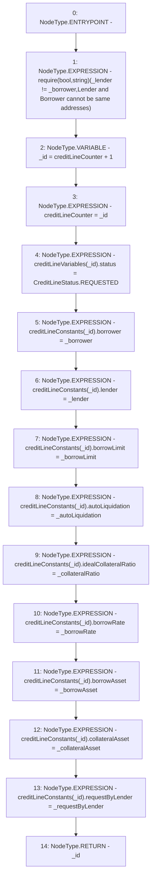

# Context: CreditLine._createRequest

**Contract:** `CreditLine` (Inherits: OwnableUpgradeable, ContextUpgradeable, Initializable, ReentrancyGuard)
**Signature:** `_createRequest(address,address,uint256,uint256,bool,uint256,address,address,bool) returns (uint256)`
**Method Selector ID:** `Internal (No Method ID)`
**Visibility:** `internal`
**Environment-Free:** `Yes`
**Modifiers:** None

### State Variables Interaction
- **Reads:** creditLineConstants, creditLineCounter, creditLineVariables
- **Writes:** creditLineConstants, creditLineCounter, creditLineVariables

### Assertion Checks & Business Requirements
- require/assert: `require(bool,string)(_lender != _borrower,Lender and Borrower cannot be same addresses)`

### Environment & Verification Flags
- **Uses Foundry Cheatcodes:** No
- **Has Echidna Properties:** No

### Internal Calls Tree
- None

### External Calls / Value Transfers
- None

### Control Flow Graph (CFG)


### Source Mapping
Declared in: `contracts/CreditLine/CreditLine.sol` on lines **562** to **587**

```solidity
    function _createRequest(
        address _lender,
        address _borrower,
        uint256 _borrowLimit,
        uint256 _borrowRate,
        bool _autoLiquidation,
        uint256 _collateralRatio,
        address _borrowAsset,
        address _collateralAsset,
        bool _requestByLender
    ) internal returns (uint256) {
        require(_lender != _borrower, 'Lender and Borrower cannot be same addresses');
        uint256 _id = creditLineCounter + 1;
        creditLineCounter = _id;
        creditLineVariables[_id].status = CreditLineStatus.REQUESTED;
        creditLineConstants[_id].borrower = _borrower;
        creditLineConstants[_id].lender = _lender;
        creditLineConstants[_id].borrowLimit = _borrowLimit;
        creditLineConstants[_id].autoLiquidation = _autoLiquidation;
        creditLineConstants[_id].idealCollateralRatio = _collateralRatio;
        creditLineConstants[_id].borrowRate = _borrowRate;
        creditLineConstants[_id].borrowAsset = _borrowAsset;
        creditLineConstants[_id].collateralAsset = _collateralAsset;
        creditLineConstants[_id].requestByLender = _requestByLender;
        return _id;
    }

```
