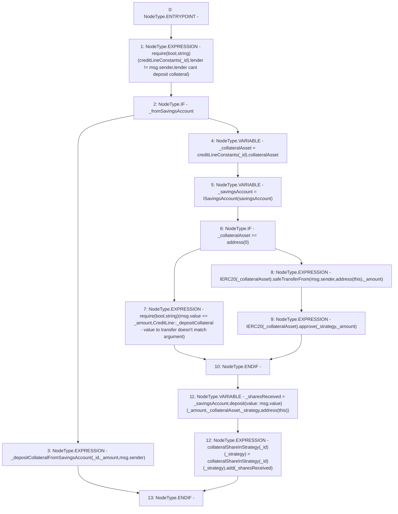

# Context: CreditLine._depositCollateral

**Contract:** `CreditLine` (Inherits: OwnableUpgradeable, ContextUpgradeable, Initializable, ReentrancyGuard)
**Signature:** `_depositCollateral(uint256,uint256,address,bool)`
**Method Selector ID:** `Internal (No Method ID)`
**Visibility:** `internal`
**Environment-Free:** `No (reads EVM state context)`
**Modifiers:** None

### State Variables Interaction
- **Reads:** collateralShareInStrategy, creditLineConstants, savingsAccount
- **Writes:** collateralShareInStrategy

### Assertion Checks & Business Requirements
- require/assert: `require(bool,string)(creditLineConstants[_id].lender != msg.sender,lender cant deposit collateral)`
- require/assert: `require(bool,string)(msg.value == _amount,CreditLine::_depositCollateral - value to transfer doesn't match argument)`

### Environment & Verification Flags
- **Uses Foundry Cheatcodes:** No
- **Has Echidna Properties:** No

### Internal Calls Tree
- None

### External Calls / Value Transfers
- `SafeERC20.LIBRARY_CALL, dest:SafeERC20, function:SafeERC20.safeTransferFrom(IERC20,address,address,uint256), arguments:['TMP_1104', 'msg.sender', 'TMP_1105', '_amount'] `
- `IERC20.TMP_1108(bool) = HIGH_LEVEL_CALL, dest:TMP_1107(IERC20), function:approve, arguments:['_strategy', '_amount']  `
- `TMP_1103(None) = SOLIDITY_CALL require(bool,string)(TMP_1102,CreditLine::_depositCollateral - value to transfer doesn't match argument)`
- `ISavingsAccount.TMP_1110(uint256) = HIGH_LEVEL_CALL, dest:_savingsAccount(ISavingsAccount), function:deposit, arguments:['_amount', '_collateralAsset', '_strategy', 'TMP_1109'] value:msg.value `
- `SafeMath.TMP_1111(uint256) = LIBRARY_CALL, dest:SafeMath, function:SafeMath.add(uint256,uint256), arguments:['REF_266', '_sharesReceived'] `

### Control Flow Graph (CFG)


### Source Mapping
Declared in: `contracts/CreditLine/CreditLine.sol` on lines **631** to **652**

```solidity
    function _depositCollateral(
        uint256 _id,
        uint256 _amount,
        address _strategy,
        bool _fromSavingsAccount
    ) internal {
        require(creditLineConstants[_id].lender != msg.sender, 'lender cant deposit collateral');
        if (_fromSavingsAccount) {
            _depositCollateralFromSavingsAccount(_id, _amount, msg.sender);
        } else {
            address _collateralAsset = creditLineConstants[_id].collateralAsset;
            ISavingsAccount _savingsAccount = ISavingsAccount(savingsAccount);
            if (_collateralAsset == address(0)) {
                require(msg.value == _amount, "CreditLine::_depositCollateral - value to transfer doesn't match argument");
            } else {
                IERC20(_collateralAsset).safeTransferFrom(msg.sender, address(this), _amount);
                IERC20(_collateralAsset).approve(_strategy, _amount);
            }
            uint256 _sharesReceived = _savingsAccount.deposit{value: msg.value}(_amount, _collateralAsset, _strategy, address(this));
            collateralShareInStrategy[_id][_strategy] = collateralShareInStrategy[_id][_strategy].add(_sharesReceived);
        }
    }

```
