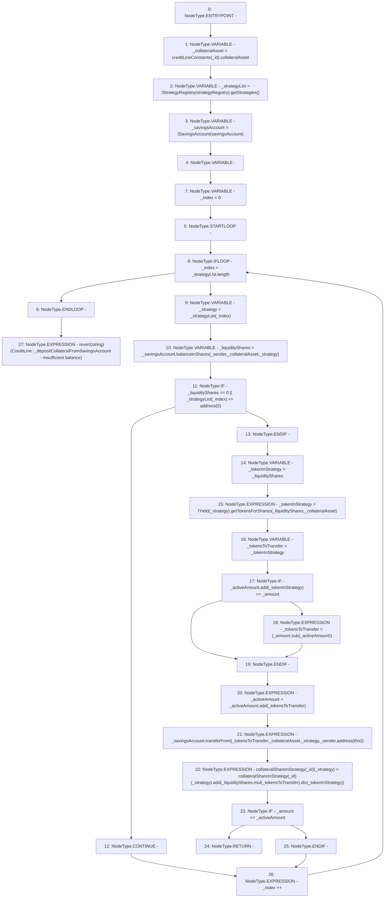

# Context: CreditLine._depositCollateralFromSavingsAccount

**Contract:** `CreditLine` (Inherits: OwnableUpgradeable, ContextUpgradeable, Initializable, ReentrancyGuard)
**Signature:** `_depositCollateralFromSavingsAccount(uint256,uint256,address)`
**Method Selector ID:** `Internal (No Method ID)`
**Visibility:** `internal`
**Environment-Free:** `Yes`
**Modifiers:** None

### State Variables Interaction
- **Reads:** collateralShareInStrategy, creditLineConstants, savingsAccount, strategyRegistry
- **Writes:** collateralShareInStrategy

### Assertion Checks & Business Requirements
- revert: `revert(string)(CreditLine::_depositCollateralFromSavingsAccount - Insufficient balance)`

### Environment & Verification Flags
- **Uses Foundry Cheatcodes:** No
- **Has Echidna Properties:** No

### Internal Calls Tree
- None

### External Calls / Value Transfers
- `SafeMath.TMP_1060(uint256) = LIBRARY_CALL, dest:SafeMath, function:SafeMath.sub(uint256,uint256), arguments:['_amount', '_activeAmount'] `
- `SafeMath.TMP_1064(uint256) = LIBRARY_CALL, dest:SafeMath, function:SafeMath.mul(uint256,uint256), arguments:['_liquidityShares', '_tokensToTransfer'] `
- `ISavingsAccount.TMP_1051(uint256) = HIGH_LEVEL_CALL, dest:_savingsAccount(ISavingsAccount), function:balanceInShares, arguments:['_sender', '_collateralAsset', '_strategy']  `
- `SafeMath.TMP_1058(uint256) = LIBRARY_CALL, dest:SafeMath, function:SafeMath.add(uint256,uint256), arguments:['_activeAmount', '_tokenInStrategy'] `
- `SafeMath.TMP_1066(uint256) = LIBRARY_CALL, dest:SafeMath, function:SafeMath.add(uint256,uint256), arguments:['REF_215', 'TMP_1065'] `
- `IStrategyRegistry.TMP_1048(address[]) = HIGH_LEVEL_CALL, dest:TMP_1047(IStrategyRegistry), function:getStrategies, arguments:[]  `
- `SafeMath.TMP_1065(uint256) = LIBRARY_CALL, dest:SafeMath, function:SafeMath.div(uint256,uint256), arguments:['TMP_1064', '_tokenInStrategy'] `
- `SafeMath.TMP_1061(uint256) = LIBRARY_CALL, dest:SafeMath, function:SafeMath.add(uint256,uint256), arguments:['_activeAmount', '_tokensToTransfer'] `
- `ISavingsAccount.TMP_1063(uint256) = HIGH_LEVEL_CALL, dest:_savingsAccount(ISavingsAccount), function:transferFrom, arguments:['_tokensToTransfer', '_collateralAsset', '_strategy', '_sender', 'TMP_1062']  `
- `IYield.TMP_1057(uint256) = HIGH_LEVEL_CALL, dest:TMP_1056(IYield), function:getTokensForShares, arguments:['_liquidityShares', '_collateralAsset']  `

### Control Flow Graph (CFG)


### Source Mapping
Declared in: `contracts/CreditLine/CreditLine.sol` on lines **474** to **509**

```solidity
    function _depositCollateralFromSavingsAccount(
        uint256 _id,
        uint256 _amount,
        address _sender
    ) internal {
        address _collateralAsset = creditLineConstants[_id].collateralAsset;
        address[] memory _strategyList = IStrategyRegistry(strategyRegistry).getStrategies();
        ISavingsAccount _savingsAccount = ISavingsAccount(savingsAccount);
        uint256 _activeAmount;

        for (uint256 _index = 0; _index < _strategyList.length; _index++) {
            address _strategy = _strategyList[_index];
            uint256 _liquidityShares = _savingsAccount.balanceInShares(_sender, _collateralAsset, _strategy);
            if (_liquidityShares == 0 || _strategyList[_index] == address(0)) {
                continue;
            }
            uint256 _tokenInStrategy = _liquidityShares;
            _tokenInStrategy = IYield(_strategy).getTokensForShares(_liquidityShares, _collateralAsset);

            uint256 _tokensToTransfer = _tokenInStrategy;
            if (_activeAmount.add(_tokenInStrategy) >= _amount) {
                _tokensToTransfer = (_amount.sub(_activeAmount));
            }
            _activeAmount = _activeAmount.add(_tokensToTransfer);
            _savingsAccount.transferFrom(_tokensToTransfer, _collateralAsset, _strategy, _sender, address(this));

            collateralShareInStrategy[_id][_strategy] = collateralShareInStrategy[_id][_strategy].add(
                _liquidityShares.mul(_tokensToTransfer).div(_tokenInStrategy)
            );

            if (_amount == _activeAmount) {
                return;
            }
        }
        revert('CreditLine::_depositCollateralFromSavingsAccount - Insufficient balance');
    }

```
