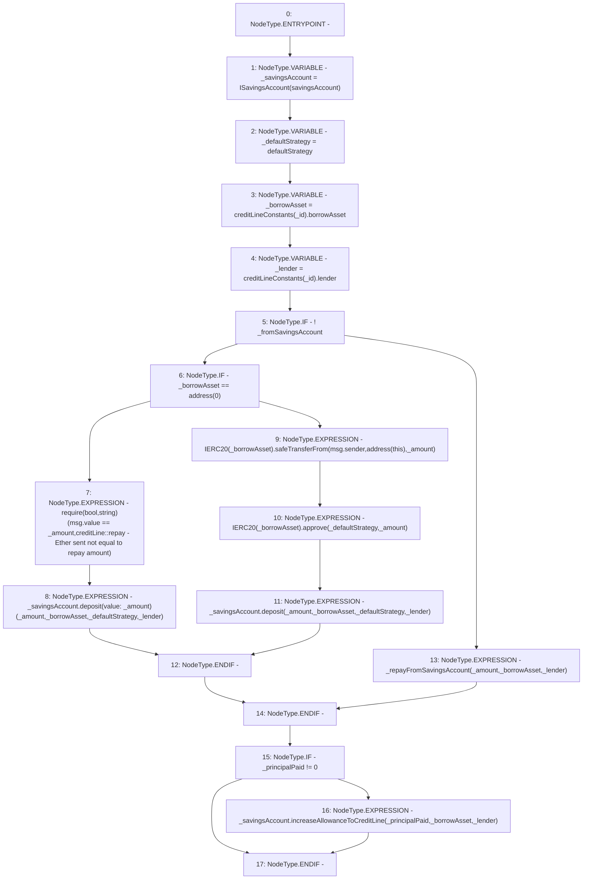

# Context: CreditLine._repay

**Contract:** `CreditLine` (Inherits: OwnableUpgradeable, ContextUpgradeable, Initializable, ReentrancyGuard)
**Signature:** `_repay(uint256,uint256,bool,uint256)`
**Method Selector ID:** `Internal (No Method ID)`
**Visibility:** `internal`
**Environment-Free:** `No (reads EVM state context)`
**Modifiers:** None

### State Variables Interaction
- **Reads:** creditLineConstants, defaultStrategy, savingsAccount
- **Writes:** None

### Assertion Checks & Business Requirements
- require/assert: `require(bool,string)(msg.value == _amount,creditLine::repay - Ether sent not equal to repay amount)`

### Environment & Verification Flags
- **Uses Foundry Cheatcodes:** No
- **Has Echidna Properties:** No

### Internal Calls Tree
- None

### External Calls / Value Transfers
- `ISavingsAccount.HIGH_LEVEL_CALL, dest:_savingsAccount(ISavingsAccount), function:increaseAllowanceToCreditLine, arguments:['_principalPaid', '_borrowAsset', '_lender']  `
- `SafeERC20.LIBRARY_CALL, dest:SafeERC20, function:SafeERC20.safeTransferFrom(IERC20,address,address,uint256), arguments:['TMP_1195', 'msg.sender', 'TMP_1196', '_amount'] `
- `IERC20.TMP_1199(bool) = HIGH_LEVEL_CALL, dest:TMP_1198(IERC20), function:approve, arguments:['_defaultStrategy', '_amount']  `
- `ISavingsAccount.TMP_1200(uint256) = HIGH_LEVEL_CALL, dest:_savingsAccount(ISavingsAccount), function:deposit, arguments:['_amount', '_borrowAsset', '_defaultStrategy', '_lender']  `
- `ISavingsAccount.TMP_1194(uint256) = HIGH_LEVEL_CALL, dest:_savingsAccount(ISavingsAccount), function:deposit, arguments:['_amount', '_borrowAsset', '_defaultStrategy', '_lender'] value:_amount `

### Control Flow Graph (CFG)


### Source Mapping
Declared in: `contracts/CreditLine/CreditLine.sol` on lines **763** to **788**

```solidity
    function _repay(
        uint256 _id,
        uint256 _amount,
        bool _fromSavingsAccount,
        uint256 _principalPaid
    ) internal {
        ISavingsAccount _savingsAccount = ISavingsAccount(savingsAccount);
        address _defaultStrategy = defaultStrategy;
        address _borrowAsset = creditLineConstants[_id].borrowAsset;
        address _lender = creditLineConstants[_id].lender;
        if (!_fromSavingsAccount) {
            if (_borrowAsset == address(0)) {
                require(msg.value == _amount, 'creditLine::repay - Ether sent not equal to repay amount');
                _savingsAccount.deposit{value: _amount}(_amount, _borrowAsset, _defaultStrategy, _lender);
            } else {
                IERC20(_borrowAsset).safeTransferFrom(msg.sender, address(this), _amount);
                IERC20(_borrowAsset).approve(_defaultStrategy, _amount);
                _savingsAccount.deposit(_amount, _borrowAsset, _defaultStrategy, _lender);
            }
        } else {
            _repayFromSavingsAccount(_amount, _borrowAsset, _lender);
        }
        if (_principalPaid != 0) {
            _savingsAccount.increaseAllowanceToCreditLine(_principalPaid, _borrowAsset, _lender);
        }
    }

```
