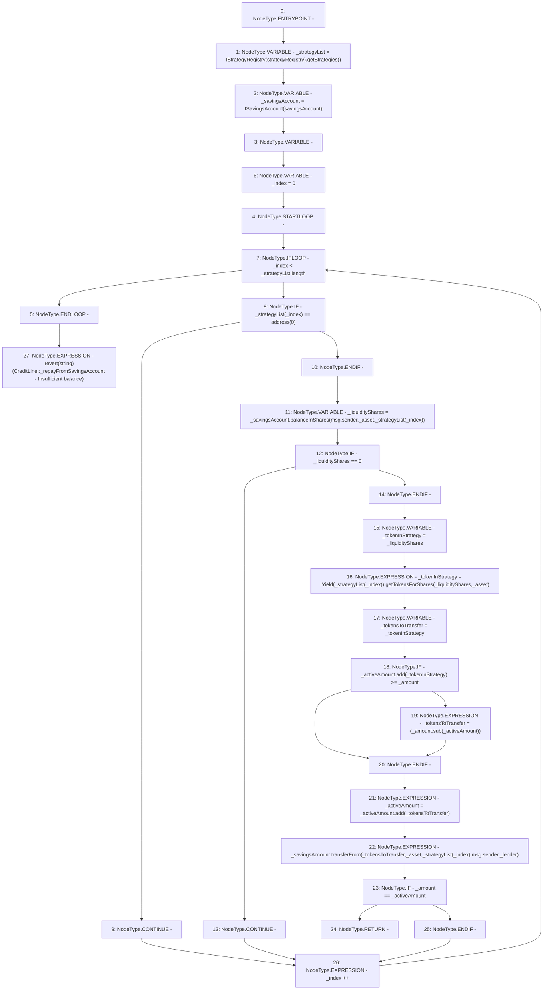

# Context: CreditLine._repayFromSavingsAccount

**Contract:** `CreditLine` (Inherits: OwnableUpgradeable, ContextUpgradeable, Initializable, ReentrancyGuard)
**Signature:** `_repayFromSavingsAccount(uint256,address,address)`
**Method Selector ID:** `Internal (No Method ID)`
**Visibility:** `internal`
**Environment-Free:** `No (reads EVM state context)`
**Modifiers:** None

### State Variables Interaction
- **Reads:** savingsAccount, strategyRegistry
- **Writes:** None

### Assertion Checks & Business Requirements
- revert: `revert(string)(CreditLine::_repayFromSavingsAccount - Insufficient balance)`

### Environment & Verification Flags
- **Uses Foundry Cheatcodes:** No
- **Has Echidna Properties:** No

### Internal Calls Tree
- None

### External Calls / Value Transfers
- `SafeMath.TMP_1183(uint256) = LIBRARY_CALL, dest:SafeMath, function:SafeMath.add(uint256,uint256), arguments:['_activeAmount', '_tokensToTransfer'] `
- `ISavingsAccount.TMP_1176(uint256) = HIGH_LEVEL_CALL, dest:_savingsAccount(ISavingsAccount), function:balanceInShares, arguments:['msg.sender', '_asset', 'REF_309']  `
- `SafeMath.TMP_1182(uint256) = LIBRARY_CALL, dest:SafeMath, function:SafeMath.sub(uint256,uint256), arguments:['_amount', '_activeAmount'] `
- `ISavingsAccount.TMP_1184(uint256) = HIGH_LEVEL_CALL, dest:_savingsAccount(ISavingsAccount), function:transferFrom, arguments:['_tokensToTransfer', '_asset', 'REF_316', 'msg.sender', '_lender']  `
- `IStrategyRegistry.TMP_1171(address[]) = HIGH_LEVEL_CALL, dest:TMP_1170(IStrategyRegistry), function:getStrategies, arguments:[]  `
- `IYield.TMP_1179(uint256) = HIGH_LEVEL_CALL, dest:TMP_1178(IYield), function:getTokensForShares, arguments:['_liquidityShares', '_asset']  `
- `SafeMath.TMP_1180(uint256) = LIBRARY_CALL, dest:SafeMath, function:SafeMath.add(uint256,uint256), arguments:['_activeAmount', '_tokenInStrategy'] `

### Control Flow Graph (CFG)


### Source Mapping
Declared in: `contracts/CreditLine/CreditLine.sol` on lines **729** to **761**

```solidity
    function _repayFromSavingsAccount(
        uint256 _amount,
        address _asset,
        address _lender
    ) internal {
        address[] memory _strategyList = IStrategyRegistry(strategyRegistry).getStrategies();
        ISavingsAccount _savingsAccount = ISavingsAccount(savingsAccount);
        uint256 _activeAmount;

        for (uint256 _index = 0; _index < _strategyList.length; _index++) {
            if (_strategyList[_index] == address(0)) {
                continue;
            }
            uint256 _liquidityShares = _savingsAccount.balanceInShares(msg.sender, _asset, _strategyList[_index]);
            if (_liquidityShares == 0) {
                continue;
            }
            uint256 _tokenInStrategy = _liquidityShares;
            _tokenInStrategy = IYield(_strategyList[_index]).getTokensForShares(_liquidityShares, _asset);

            uint256 _tokensToTransfer = _tokenInStrategy;
            if (_activeAmount.add(_tokenInStrategy) >= _amount) {
                _tokensToTransfer = (_amount.sub(_activeAmount));
            }
            _activeAmount = _activeAmount.add(_tokensToTransfer);
            _savingsAccount.transferFrom(_tokensToTransfer, _asset, _strategyList[_index], msg.sender, _lender);

            if (_amount == _activeAmount) {
                return;
            }
        }
        revert('CreditLine::_repayFromSavingsAccount - Insufficient balance');
    }

```
