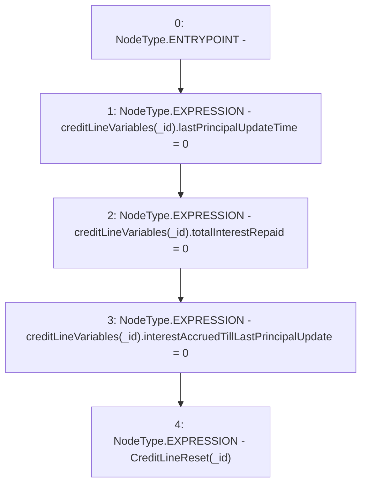

# Context: CreditLine._resetCreditLine

**Contract:** `CreditLine` (Inherits: OwnableUpgradeable, ContextUpgradeable, Initializable, ReentrancyGuard)
**Signature:** `_resetCreditLine(uint256)`
**Method Selector ID:** `Internal (No Method ID)`
**Visibility:** `internal`
**Environment-Free:** `Yes`
**Modifiers:** None

### State Variables Interaction
- **Reads:** creditLineVariables
- **Writes:** creditLineVariables

### Environment & Verification Flags
- **Uses Foundry Cheatcodes:** No
- **Has Echidna Properties:** No

### Internal Calls Tree
- None

### External Calls / Value Transfers
- None

### Control Flow Graph (CFG)


### Source Mapping
Declared in: `contracts/CreditLine/CreditLine.sol` on lines **838** to **843**

```solidity
    function _resetCreditLine(uint256 _id) internal {
        creditLineVariables[_id].lastPrincipalUpdateTime = 0;
        creditLineVariables[_id].totalInterestRepaid = 0;
        creditLineVariables[_id].interestAccruedTillLastPrincipalUpdate = 0;
        emit CreditLineReset(_id);
    }

```
