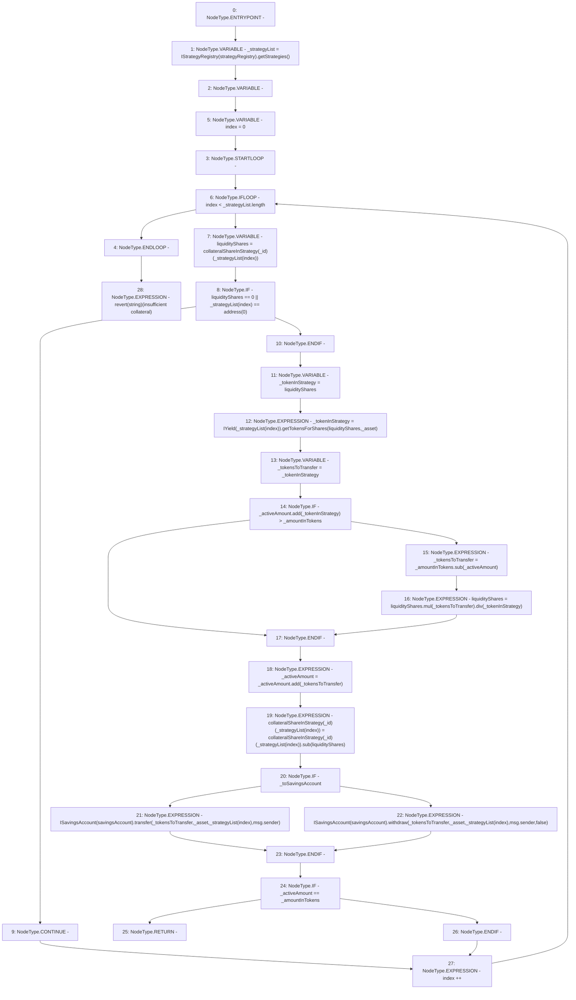

# Context: CreditLine._transferCollateral

**Contract:** `CreditLine` (Inherits: OwnableUpgradeable, ContextUpgradeable, Initializable, ReentrancyGuard)
**Signature:** `_transferCollateral(uint256,address,uint256,bool)`
**Method Selector ID:** `Internal (No Method ID)`
**Visibility:** `internal`
**Environment-Free:** `No (reads EVM state context)`
**Modifiers:** None

### State Variables Interaction
- **Reads:** collateralShareInStrategy, savingsAccount, strategyRegistry
- **Writes:** collateralShareInStrategy

### Assertion Checks & Business Requirements
- revert: `revert(string)(insufficient collateral)`

### Environment & Verification Flags
- **Uses Foundry Cheatcodes:** No
- **Has Echidna Properties:** No

### Internal Calls Tree
- None

### External Calls / Value Transfers
- `SafeMath.TMP_1287(uint256) = LIBRARY_CALL, dest:SafeMath, function:SafeMath.add(uint256,uint256), arguments:['_activeAmount', '_tokensToTransfer'] `
- `SafeMath.TMP_1288(uint256) = LIBRARY_CALL, dest:SafeMath, function:SafeMath.sub(uint256,uint256), arguments:['REF_429', 'liquidityShares'] `
- `SafeMath.TMP_1286(uint256) = LIBRARY_CALL, dest:SafeMath, function:SafeMath.div(uint256,uint256), arguments:['TMP_1285', '_tokenInStrategy'] `
- `ISavingsAccount.TMP_1292(uint256) = HIGH_LEVEL_CALL, dest:TMP_1291(ISavingsAccount), function:withdraw, arguments:['_tokensToTransfer', '_asset', 'REF_434', 'msg.sender', 'False']  `
- `SafeMath.TMP_1284(uint256) = LIBRARY_CALL, dest:SafeMath, function:SafeMath.sub(uint256,uint256), arguments:['_amountInTokens', '_activeAmount'] `
- `IYield.TMP_1281(uint256) = HIGH_LEVEL_CALL, dest:TMP_1280(IYield), function:getTokensForShares, arguments:['liquidityShares', '_asset']  `
- `SafeMath.TMP_1285(uint256) = LIBRARY_CALL, dest:SafeMath, function:SafeMath.mul(uint256,uint256), arguments:['liquidityShares', '_tokensToTransfer'] `
- `IStrategyRegistry.TMP_1274(address[]) = HIGH_LEVEL_CALL, dest:TMP_1273(IStrategyRegistry), function:getStrategies, arguments:[]  `
- `ISavingsAccount.TMP_1290(uint256) = HIGH_LEVEL_CALL, dest:TMP_1289(ISavingsAccount), function:transfer, arguments:['_tokensToTransfer', '_asset', 'REF_432', 'msg.sender']  `
- `SafeMath.TMP_1282(uint256) = LIBRARY_CALL, dest:SafeMath, function:SafeMath.add(uint256,uint256), arguments:['_activeAmount', '_tokenInStrategy'] `

### Control Flow Graph (CFG)


### Source Mapping
Declared in: `contracts/CreditLine/CreditLine.sol` on lines **951** to **986**

```solidity
    function _transferCollateral(
        uint256 _id,
        address _asset,
        uint256 _amountInTokens,
        bool _toSavingsAccount
    ) internal {
        address[] memory _strategyList = IStrategyRegistry(strategyRegistry).getStrategies();
        uint256 _activeAmount;
        for (uint256 index = 0; index < _strategyList.length; index++) {
            uint256 liquidityShares = collateralShareInStrategy[_id][_strategyList[index]];
            if (liquidityShares == 0 || _strategyList[index] == address(0)) {
                continue;
            }
            uint256 _tokenInStrategy = liquidityShares;
            _tokenInStrategy = IYield(_strategyList[index]).getTokensForShares(liquidityShares, _asset);
            uint256 _tokensToTransfer = _tokenInStrategy;
            if (_activeAmount.add(_tokenInStrategy) > _amountInTokens) {
                _tokensToTransfer = _amountInTokens.sub(_activeAmount);
                liquidityShares = liquidityShares.mul(_tokensToTransfer).div(_tokenInStrategy);
            }
            _activeAmount = _activeAmount.add(_tokensToTransfer);
            collateralShareInStrategy[_id][_strategyList[index]] = collateralShareInStrategy[_id][_strategyList[index]].sub(
                liquidityShares
            );
            if (_toSavingsAccount) {
                ISavingsAccount(savingsAccount).transfer(_tokensToTransfer, _asset, _strategyList[index], msg.sender);
            } else {
                ISavingsAccount(savingsAccount).withdraw(_tokensToTransfer, _asset, _strategyList[index], msg.sender, false);
            }

            if (_activeAmount == _amountInTokens) {
                return;
            }
        }
        revert('insufficient collateral');
    }

```
