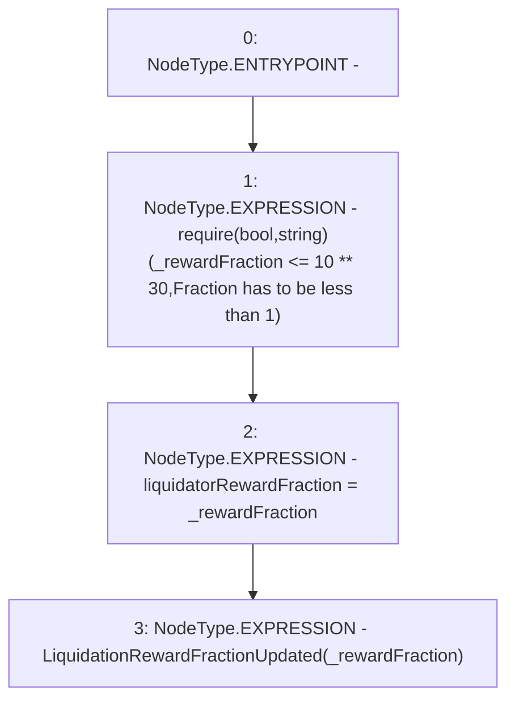

# Context: CreditLine._updateLiquidatorRewardFraction

**Contract:** `CreditLine` (Inherits: OwnableUpgradeable, ContextUpgradeable, Initializable, ReentrancyGuard)
**Signature:** `_updateLiquidatorRewardFraction(uint256)`
**Method Selector ID:** `Internal (No Method ID)`
**Visibility:** `internal`
**Environment-Free:** `Yes`
**Modifiers:** None

### State Variables Interaction
- **Reads:** None
- **Writes:** liquidatorRewardFraction

### Assertion Checks & Business Requirements
- require/assert: `require(bool,string)(_rewardFraction <= 10 ** 30,Fraction has to be less than 1)`

### Environment & Verification Flags
- **Uses Foundry Cheatcodes:** No
- **Has Echidna Properties:** No

### Internal Calls Tree
- None

### External Calls / Value Transfers
- None

### Control Flow Graph (CFG)


### Source Mapping
Declared in: `contracts/CreditLine/CreditLine.sol` on lines **379** to **383**

```solidity
    function _updateLiquidatorRewardFraction(uint256 _rewardFraction) internal {
        require(_rewardFraction <= 10**30, 'Fraction has to be less than 1');
        liquidatorRewardFraction = _rewardFraction;
        emit LiquidationRewardFractionUpdated(_rewardFraction);
    }

```
