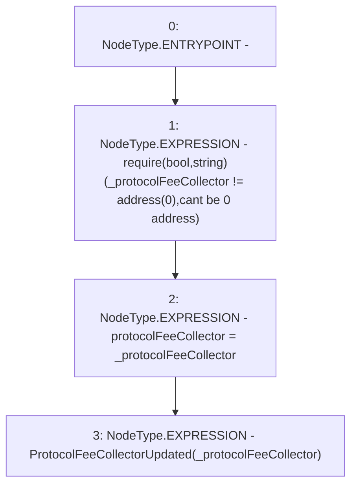

# Context: CreditLine._updateProtocolFeeCollector

**Contract:** `CreditLine` (Inherits: OwnableUpgradeable, ContextUpgradeable, Initializable, ReentrancyGuard)
**Signature:** `_updateProtocolFeeCollector(address)`
**Method Selector ID:** `Internal (No Method ID)`
**Visibility:** `internal`
**Environment-Free:** `Yes`
**Modifiers:** None

### State Variables Interaction
- **Reads:** None
- **Writes:** protocolFeeCollector

### Assertion Checks & Business Requirements
- require/assert: `require(bool,string)(_protocolFeeCollector != address(0),cant be 0 address)`

### Environment & Verification Flags
- **Uses Foundry Cheatcodes:** No
- **Has Echidna Properties:** No

### Internal Calls Tree
- None

### External Calls / Value Transfers
- None

### Control Flow Graph (CFG)


### Source Mapping
Declared in: `contracts/CreditLine/CreditLine.sol` on lines **349** to **353**

```solidity
    function _updateProtocolFeeCollector(address _protocolFeeCollector) internal {
        require(_protocolFeeCollector != address(0), 'cant be 0 address');
        protocolFeeCollector = _protocolFeeCollector;
        emit ProtocolFeeCollectorUpdated(_protocolFeeCollector);
    }

```
