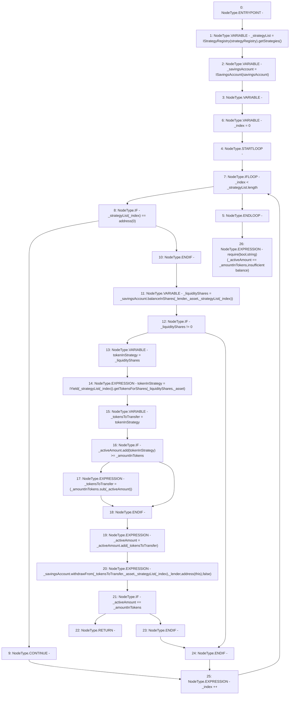

# Context: CreditLine._withdrawBorrowAmount

**Contract:** `CreditLine` (Inherits: OwnableUpgradeable, ContextUpgradeable, Initializable, ReentrancyGuard)
**Signature:** `_withdrawBorrowAmount(address,uint256,address)`
**Method Selector ID:** `Internal (No Method ID)`
**Visibility:** `internal`
**Environment-Free:** `Yes`
**Modifiers:** None

### State Variables Interaction
- **Reads:** savingsAccount, strategyRegistry
- **Writes:** None

### Assertion Checks & Business Requirements
- require/assert: `require(bool,string)(_activeAmount == _amountInTokens,insufficient balance)`

### Environment & Verification Flags
- **Uses Foundry Cheatcodes:** No
- **Has Echidna Properties:** No

### Internal Calls Tree
- None

### External Calls / Value Transfers
- `ISavingsAccount.TMP_1118(uint256) = HIGH_LEVEL_CALL, dest:_savingsAccount(ISavingsAccount), function:balanceInShares, arguments:['_lender', '_asset', 'REF_272']  `
- `IYield.TMP_1121(uint256) = HIGH_LEVEL_CALL, dest:TMP_1120(IYield), function:getTokensForShares, arguments:['_liquidityShares', '_asset']  `
- `ISavingsAccount.TMP_1127(uint256) = HIGH_LEVEL_CALL, dest:_savingsAccount(ISavingsAccount), function:withdrawFrom, arguments:['_tokensToTransfer', '_asset', 'REF_279', '_lender', 'TMP_1126', 'False']  `
- `SafeMath.TMP_1125(uint256) = LIBRARY_CALL, dest:SafeMath, function:SafeMath.add(uint256,uint256), arguments:['_activeAmount', '_tokensToTransfer'] `
- `IStrategyRegistry.TMP_1113(address[]) = HIGH_LEVEL_CALL, dest:TMP_1112(IStrategyRegistry), function:getStrategies, arguments:[]  `
- `SafeMath.TMP_1124(uint256) = LIBRARY_CALL, dest:SafeMath, function:SafeMath.sub(uint256,uint256), arguments:['_amountInTokens', '_activeAmount'] `
- `SafeMath.TMP_1122(uint256) = LIBRARY_CALL, dest:SafeMath, function:SafeMath.add(uint256,uint256), arguments:['_activeAmount', 'tokenInStrategy'] `

### Control Flow Graph (CFG)


### Source Mapping
Declared in: `contracts/CreditLine/CreditLine.sol` on lines **654** to **682**

```solidity
    function _withdrawBorrowAmount(
        address _asset,
        uint256 _amountInTokens,
        address _lender
    ) internal {
        address[] memory _strategyList = IStrategyRegistry(strategyRegistry).getStrategies();
        ISavingsAccount _savingsAccount = ISavingsAccount(savingsAccount);
        uint256 _activeAmount;
        for (uint256 _index = 0; _index < _strategyList.length; _index++) {
            if (_strategyList[_index] == address(0)) {
                continue;
            }
            uint256 _liquidityShares = _savingsAccount.balanceInShares(_lender, _asset, _strategyList[_index]);
            if (_liquidityShares != 0) {
                uint256 tokenInStrategy = _liquidityShares;
                tokenInStrategy = IYield(_strategyList[_index]).getTokensForShares(_liquidityShares, _asset);
                uint256 _tokensToTransfer = tokenInStrategy;
                if (_activeAmount.add(tokenInStrategy) >= _amountInTokens) {
                    _tokensToTransfer = (_amountInTokens.sub(_activeAmount));
                }
                _activeAmount = _activeAmount.add(_tokensToTransfer);
                _savingsAccount.withdrawFrom(_tokensToTransfer, _asset, _strategyList[_index], _lender, address(this), false);
                if (_activeAmount == _amountInTokens) {
                    return;
                }
            }
        }
        require(_activeAmount == _amountInTokens, 'insufficient balance');
    }

```
