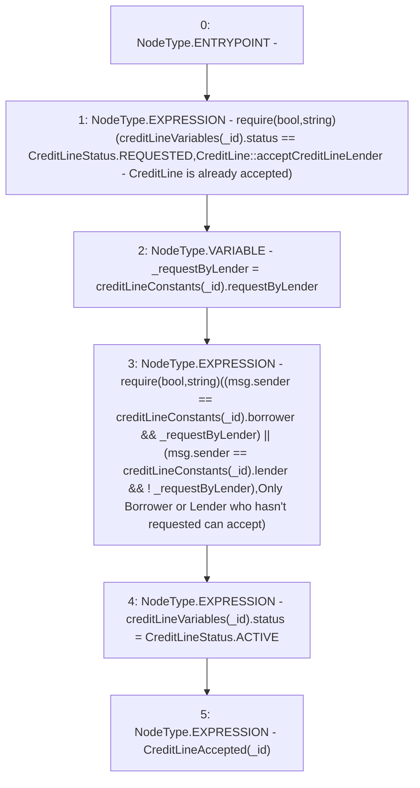

# Context: CreditLine.accept

**Contract:** `CreditLine` (Inherits: OwnableUpgradeable, ContextUpgradeable, Initializable, ReentrancyGuard)
**Signature:** `accept(uint256)`
**Method Selector ID:** `0x19b05f49`
**Visibility:** `external`
**Environment-Free:** `No (reads EVM state context)`
**Modifiers:** None

### State Variables Interaction
- **Reads:** creditLineConstants, creditLineVariables
- **Writes:** creditLineVariables

### Assertion Checks & Business Requirements
- require/assert: `require(bool,string)(creditLineVariables[_id].status == CreditLineStatus.REQUESTED,CreditLine::acceptCreditLineLender - CreditLine is already accepted)`
- require/assert: `require(bool,string)((msg.sender == creditLineConstants[_id].borrower && _requestByLender) || (msg.sender == creditLineConstants[_id].lender && ! _requestByLender),Only Borrower or Lender who hasn't requested can accept)`

### Environment & Verification Flags
- **Uses Foundry Cheatcodes:** No
- **Has Echidna Properties:** No

### Internal Calls Tree
- None

### External Calls / Value Transfers
- None

### Control Flow Graph (CFG)


### Source Mapping
Declared in: `contracts/CreditLine/CreditLine.sol` on lines **594** to **607**

```solidity
    function accept(uint256 _id) external {
        require(
            creditLineVariables[_id].status == CreditLineStatus.REQUESTED,
            'CreditLine::acceptCreditLineLender - CreditLine is already accepted'
        );
        bool _requestByLender = creditLineConstants[_id].requestByLender;
        require(
            (msg.sender == creditLineConstants[_id].borrower && _requestByLender) ||
                (msg.sender == creditLineConstants[_id].lender && !_requestByLender),
            "Only Borrower or Lender who hasn't requested can accept"
        );
        creditLineVariables[_id].status = CreditLineStatus.ACTIVE;
        emit CreditLineAccepted(_id);
    }

```
