# Context: CreditLine.borrow

**Contract:** `CreditLine` (Inherits: OwnableUpgradeable, ContextUpgradeable, Initializable, ReentrancyGuard)
**Signature:** `borrow(uint256,uint256)`
**Method Selector ID:** `0x0ecbcdab`
**Visibility:** `external`
**Environment-Free:** `No (reads EVM state context)`
**Modifiers:**
- `nonReentrant`
  ```solidity
  modifier nonReentrant() {
          // On the first call to nonReentrant, _notEntered will be true
          require(_status != _ENTERED, "ReentrancyGuard: reentrant call");
  
          // Any calls to nonReentrant after this point will fail
          _status = _ENTERED;
  
          _;
  
          // By storing the original value once again, a refund is triggered (see
          // https://eips.ethereum.org/EIPS/eip-2200)
          _status = _NOT_ENTERED;
      }
  ```
- `onlyCreditLineBorrower`
  ```solidity
  modifier onlyCreditLineBorrower(uint256 _id) {
          require(creditLineConstants[_id].borrower == msg.sender, 'Only credit line Borrower can access');
          _;
      }
  ```

### State Variables Interaction
- **Reads:** creditLineConstants, creditLineVariables, protocolFeeCollector, protocolFeeFraction
- **Writes:** creditLineVariables

### Assertion Checks & Business Requirements
- require/assert: `require(bool,string)(creditLineVariables[_id].status == CreditLineStatus.ACTIVE,CreditLine: The credit line is not yet active.)`
- require/assert: `require(bool,string)(_amount <= _borrowableAmount,CreditLine::borrow - The current collateral ratio doesn't allow to withdraw the amount)`
- require/assert: `require(bool,string)(feeSuccess,Transfer fail)`
- require/assert: `require(bool,string)(success,Transfer fail)`

### Environment & Verification Flags
- **Uses Foundry Cheatcodes:** No
- **Has Echidna Properties:** No

### Internal Calls Tree
- None

### External Calls / Value Transfers
- `SafeERC20.LIBRARY_CALL, dest:SafeERC20, function:SafeERC20.safeTransfer(IERC20,address,uint256), arguments:['TMP_1165', 'msg.sender', '_tokenDiffBalance'] `
- `SafeMath.TMP_1155(uint256) = LIBRARY_CALL, dest:SafeMath, function:SafeMath.mul(uint256,uint256), arguments:['_tokenDiffBalance', 'protocolFeeFraction'] `
- `SafeMath.TMP_1158(uint256) = LIBRARY_CALL, dest:SafeMath, function:SafeMath.sub(uint256,uint256), arguments:['_tokenDiffBalance', '_protocolFee'] `
- `IERC20.TMP_1147(uint256) = HIGH_LEVEL_CALL, dest:TMP_1145(IERC20), function:balanceOf, arguments:['TMP_1146']  `
- `SafeMath.TMP_1138(uint256) = LIBRARY_CALL, dest:SafeMath, function:SafeMath.add(uint256,uint256), arguments:['REF_290', '_amount'] `
- `SafeMath.TMP_1157(uint256) = LIBRARY_CALL, dest:SafeMath, function:SafeMath.div(uint256,uint256), arguments:['TMP_1155', 'TMP_1156'] `
- `SafeMath.TMP_1148(uint256) = LIBRARY_CALL, dest:SafeMath, function:SafeMath.sub(uint256,uint256), arguments:['_balanceAfter', '_balanceBefore'] `
- `SafeERC20.LIBRARY_CALL, dest:SafeERC20, function:SafeERC20.safeTransfer(IERC20,address,uint256), arguments:['TMP_1163', 'protocolFeeCollector', '_protocolFee'] `
- `IERC20.TMP_1143(uint256) = HIGH_LEVEL_CALL, dest:TMP_1141(IERC20), function:balanceOf, arguments:['TMP_1142']  `
- `low-level-call`
- `SafeMath.TMP_1154(uint256) = LIBRARY_CALL, dest:SafeMath, function:SafeMath.sub(uint256,uint256), arguments:['_balanceAfter_scope_1', '_balanceBefore_scope_0'] `

### Control Flow Graph (CFG)

```mermaid
flowchart TD
    Node_0["0: NodeType.ENTRYPOINT - "]
    Node_0 --> Node_33
    Node_1["1: NodeType.EXPRESSION - require(bool,string)(creditLineVariables(_id).status == CreditLineStatus.ACTIVE,CreditLine: The credit line is not yet active.)"]
    Node_1 --> Node_2
    Node_2["2: NodeType.VARIABLE - _borrowableAmount = calculateBorrowableAmount(_id)"]
    Node_2 --> Node_3
    Node_3["3: NodeType.EXPRESSION - require(bool,string)(_amount <= _borrowableAmount,CreditLine::borrow - The current collateral ratio doesn't allow to withdraw the amount)"]
    Node_3 --> Node_4
    Node_4["4: NodeType.VARIABLE - _borrowAsset = creditLineConstants(_id).borrowAsset"]
    Node_4 --> Node_5
    Node_5["5: NodeType.VARIABLE - _lender = creditLineConstants(_id).lender"]
    Node_5 --> Node_6
    Node_6["6: NodeType.EXPRESSION - updateinterestAccruedTillLastPrincipalUpdate(_id)"]
    Node_6 --> Node_7
    Node_7["7: NodeType.EXPRESSION - creditLineVariables(_id).principal = creditLineVariables(_id).principal.add(_amount)"]
    Node_7 --> Node_8
    Node_8["8: NodeType.EXPRESSION - creditLineVariables(_id).lastPrincipalUpdateTime = block.timestamp"]
    Node_8 --> Node_9
    Node_9["9: NodeType.VARIABLE - "]
    Node_9 --> Node_10
    Node_10["10: NodeType.IF - _borrowAsset != address(0)"]
    Node_10 --> Node_11
    Node_10 --> Node_15
    Node_11["11: NodeType.VARIABLE - _balanceBefore = IERC20(_borrowAsset).balanceOf(address(this))"]
    Node_11 --> Node_12
    Node_12["12: NodeType.EXPRESSION - _withdrawBorrowAmount(_borrowAsset,_amount,_lender)"]
    Node_12 --> Node_13
    Node_13["13: NodeType.VARIABLE - _balanceAfter = IERC20(_borrowAsset).balanceOf(address(this))"]
    Node_13 --> Node_14
    Node_14["14: NodeType.EXPRESSION - _tokenDiffBalance = _balanceAfter.sub(_balanceBefore)"]
    Node_14 --> Node_19
    Node_15["15: NodeType.VARIABLE - _balanceBefore_scope_0 = address(this).balance"]
    Node_15 --> Node_16
    Node_16["16: NodeType.EXPRESSION - _withdrawBorrowAmount(_borrowAsset,_amount,_lender)"]
    Node_16 --> Node_17
    Node_17["17: NodeType.VARIABLE - _balanceAfter_scope_1 = address(this).balance"]
    Node_17 --> Node_18
    Node_18["18: NodeType.EXPRESSION - _tokenDiffBalance = _balanceAfter_scope_1.sub(_balanceBefore_scope_0)"]
    Node_18 --> Node_19
    Node_19["19: NodeType.ENDIF - "]
    Node_19 --> Node_20
    Node_20["20: NodeType.VARIABLE - _protocolFee = _tokenDiffBalance.mul(protocolFeeFraction).div(10 ** 30)"]
    Node_20 --> Node_21
    Node_21["21: NodeType.EXPRESSION - _tokenDiffBalance = _tokenDiffBalance.sub(_protocolFee)"]
    Node_21 --> Node_22
    Node_22["22: NodeType.IF - _borrowAsset == address(0)"]
    Node_22 --> Node_23
    Node_22 --> Node_29
    Node_23["23: NodeType.VARIABLE - "]
    Node_23 --> Node_24
    Node_24["24: NodeType.EXPRESSION - (feeSuccess,None) = protocolFeeCollector.call(value: _protocolFee)()"]
    Node_24 --> Node_25
    Node_25["25: NodeType.EXPRESSION - require(bool,string)(feeSuccess,Transfer fail)"]
    Node_25 --> Node_26
    Node_26["26: NodeType.VARIABLE - "]
    Node_26 --> Node_27
    Node_27["27: NodeType.EXPRESSION - (success,None) = msg.sender.call(value: _tokenDiffBalance)()"]
    Node_27 --> Node_28
    Node_28["28: NodeType.EXPRESSION - require(bool,string)(success,Transfer fail)"]
    Node_28 --> Node_31
    Node_29["29: NodeType.EXPRESSION - IERC20(_borrowAsset).safeTransfer(protocolFeeCollector,_protocolFee)"]
    Node_29 --> Node_30
    Node_30["30: NodeType.EXPRESSION - IERC20(_borrowAsset).safeTransfer(msg.sender,_tokenDiffBalance)"]
    Node_30 --> Node_31
    Node_31["31: NodeType.ENDIF - "]
    Node_31 --> Node_32
    Node_32["32: NodeType.EXPRESSION - BorrowedFromCreditLine(_id,_tokenDiffBalance)"]
    Node_33["33: NodeType.EXPRESSION - nonReentrant()"]
    Node_33 --> Node_34
    Node_34["34: NodeType.EXPRESSION - onlyCreditLineBorrower(_id)"]
    Node_34 --> Node_1
```


### Source Mapping
Declared in: `contracts/CreditLine/CreditLine.sol` on lines **691** to **727**

```solidity
    function borrow(uint256 _id, uint256 _amount) external payable nonReentrant onlyCreditLineBorrower(_id) {
        require(creditLineVariables[_id].status == CreditLineStatus.ACTIVE, 'CreditLine: The credit line is not yet active.');
        uint256 _borrowableAmount = calculateBorrowableAmount(_id);
        require(_amount <= _borrowableAmount, "CreditLine::borrow - The current collateral ratio doesn't allow to withdraw the amount");
        address _borrowAsset = creditLineConstants[_id].borrowAsset;
        address _lender = creditLineConstants[_id].lender;

        updateinterestAccruedTillLastPrincipalUpdate(_id);
        creditLineVariables[_id].principal = creditLineVariables[_id].principal.add(_amount);
        creditLineVariables[_id].lastPrincipalUpdateTime = block.timestamp;

        uint256 _tokenDiffBalance;
        if (_borrowAsset != address(0)) {
            uint256 _balanceBefore = IERC20(_borrowAsset).balanceOf(address(this));
            _withdrawBorrowAmount(_borrowAsset, _amount, _lender);
            uint256 _balanceAfter = IERC20(_borrowAsset).balanceOf(address(this));
            _tokenDiffBalance = _balanceAfter.sub(_balanceBefore);
        } else {
            uint256 _balanceBefore = address(this).balance;
            _withdrawBorrowAmount(_borrowAsset, _amount, _lender);
            uint256 _balanceAfter = address(this).balance;
            _tokenDiffBalance = _balanceAfter.sub(_balanceBefore);
        }
        uint256 _protocolFee = _tokenDiffBalance.mul(protocolFeeFraction).div(10**30);
        _tokenDiffBalance = _tokenDiffBalance.sub(_protocolFee);

        if (_borrowAsset == address(0)) {
            (bool feeSuccess, ) = protocolFeeCollector.call{value: _protocolFee}('');
            require(feeSuccess, 'Transfer fail');
            (bool success, ) = msg.sender.call{value: _tokenDiffBalance}('');
            require(success, 'Transfer fail');
        } else {
            IERC20(_borrowAsset).safeTransfer(protocolFeeCollector, _protocolFee);
            IERC20(_borrowAsset).safeTransfer(msg.sender, _tokenDiffBalance);
        }
        emit BorrowedFromCreditLine(_id, _tokenDiffBalance);
    }

```
