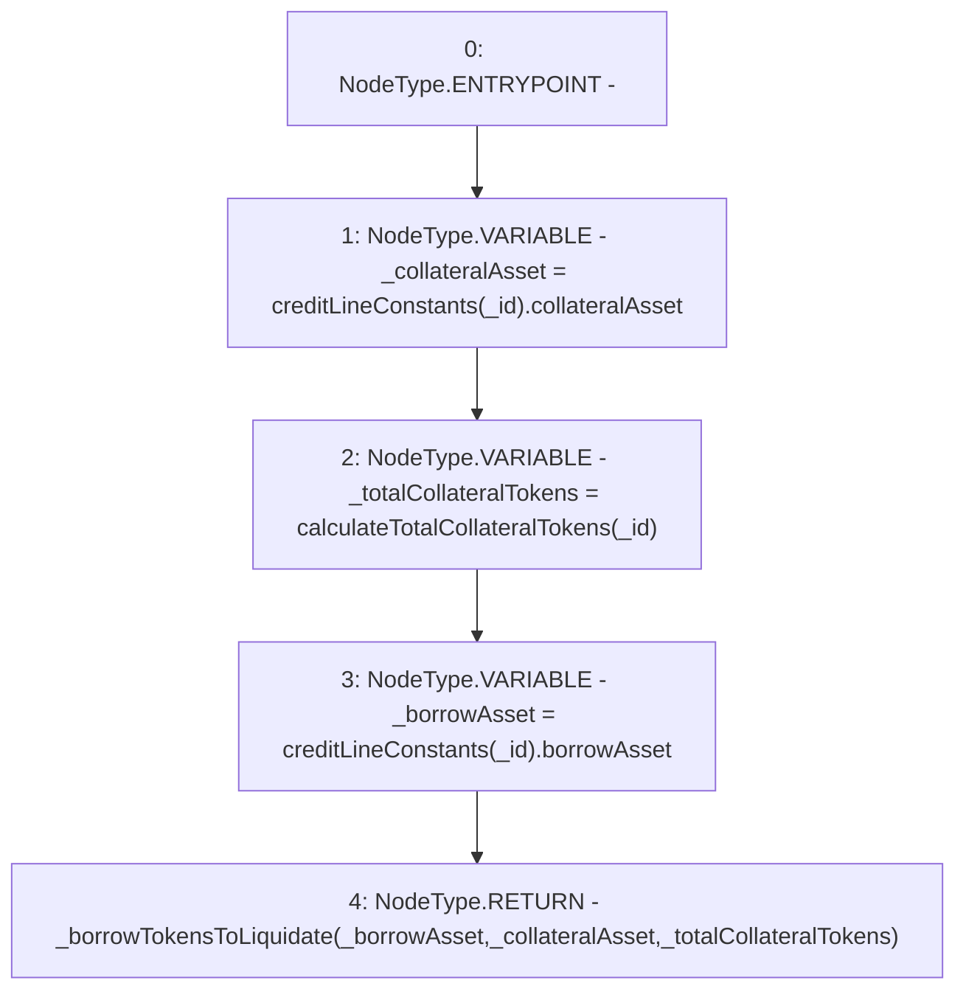

# Context: CreditLine.borrowTokensToLiquidate

**Contract:** `CreditLine` (Inherits: OwnableUpgradeable, ContextUpgradeable, Initializable, ReentrancyGuard)
**Signature:** `borrowTokensToLiquidate(uint256) returns (uint256)`
**Method Selector ID:** `0x65b59b5d`
**Visibility:** `external`
**Environment-Free:** `Yes`
**Modifiers:** None

### State Variables Interaction
- **Reads:** creditLineConstants
- **Writes:** None

### Environment & Verification Flags
- **Uses Foundry Cheatcodes:** No
- **Has Echidna Properties:** No

### Internal Calls Tree
- None

### External Calls / Value Transfers
- None

### Control Flow Graph (CFG)


### Source Mapping
Declared in: `contracts/CreditLine/CreditLine.sol` on lines **1037** to **1043**

```solidity
    function borrowTokensToLiquidate(uint256 _id) external returns (uint256) {
        address _collateralAsset = creditLineConstants[_id].collateralAsset;
        uint256 _totalCollateralTokens = calculateTotalCollateralTokens(_id);
        address _borrowAsset = creditLineConstants[_id].borrowAsset;

        return _borrowTokensToLiquidate(_borrowAsset, _collateralAsset, _totalCollateralTokens);
    }

```
