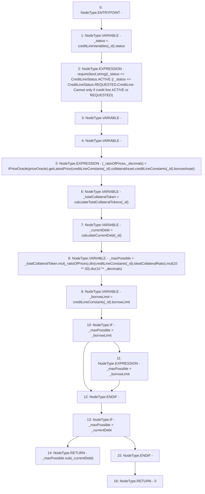

# Context: CreditLine.calculateBorrowableAmount

**Contract:** `CreditLine` (Inherits: OwnableUpgradeable, ContextUpgradeable, Initializable, ReentrancyGuard)
**Signature:** `calculateBorrowableAmount(uint256) returns (uint256)`
**Method Selector ID:** `0x6a46c1e1`
**Visibility:** `public`
**Environment-Free:** `No (reads EVM state context)`
**Modifiers:** None

### State Variables Interaction
- **Reads:** creditLineConstants, creditLineVariables, priceOracle
- **Writes:** None

### Assertion Checks & Business Requirements
- require/assert: `require(bool,string)(_status == CreditLineStatus.ACTIVE || _status == CreditLineStatus.REQUESTED,CreditLine: Cannot only if credit line ACTIVE or REQUESTED)`

### Environment & Verification Flags
- **Uses Foundry Cheatcodes:** No
- **Has Echidna Properties:** No

### Internal Calls Tree
- None

### External Calls / Value Transfers
- `SafeMath.TMP_1042(uint256) = LIBRARY_CALL, dest:SafeMath, function:SafeMath.sub(uint256,uint256), arguments:['_maxPossible', '_currentDebt'] `
- `SafeMath.TMP_1035(uint256) = LIBRARY_CALL, dest:SafeMath, function:SafeMath.div(uint256,uint256), arguments:['TMP_1034', 'REF_186'] `
- `SafeMath.TMP_1037(uint256) = LIBRARY_CALL, dest:SafeMath, function:SafeMath.mul(uint256,uint256), arguments:['TMP_1035', 'TMP_1036'] `
- `SafeMath.TMP_1034(uint256) = LIBRARY_CALL, dest:SafeMath, function:SafeMath.mul(uint256,uint256), arguments:['_totalCollateralToken', '_ratioOfPrices'] `
- `IPriceOracle.TUPLE_8(uint256,uint256) = HIGH_LEVEL_CALL, dest:TMP_1031(IPriceOracle), function:getLatestPrice, arguments:['REF_180', 'REF_182']  `
- `SafeMath.TMP_1039(uint256) = LIBRARY_CALL, dest:SafeMath, function:SafeMath.div(uint256,uint256), arguments:['TMP_1037', 'TMP_1038'] `

### Control Flow Graph (CFG)


### Source Mapping
Declared in: `contracts/CreditLine/CreditLine.sol` on lines **436** to **464**

```solidity
    function calculateBorrowableAmount(uint256 _id) public returns (uint256) {
        CreditLineStatus _status = creditLineVariables[_id].status;
        require(
            _status == CreditLineStatus.ACTIVE || _status == CreditLineStatus.REQUESTED,
            'CreditLine: Cannot only if credit line ACTIVE or REQUESTED'
        );
        (uint256 _ratioOfPrices, uint256 _decimals) = IPriceOracle(priceOracle).getLatestPrice(
            creditLineConstants[_id].collateralAsset,
            creditLineConstants[_id].borrowAsset
        );

        uint256 _totalCollateralToken = calculateTotalCollateralTokens(_id);

        uint256 _currentDebt = calculateCurrentDebt(_id);

        uint256 _maxPossible = _totalCollateralToken.mul(_ratioOfPrices).div(creditLineConstants[_id].idealCollateralRatio).mul(10**30).div(
            10**_decimals
        );

        uint256 _borrowLimit = creditLineConstants[_id].borrowLimit;

        if (_maxPossible > _borrowLimit) {
            _maxPossible = _borrowLimit;
        }
        if (_maxPossible > _currentDebt) {
            return _maxPossible.sub(_currentDebt);
        }
        return 0;
    }

```
