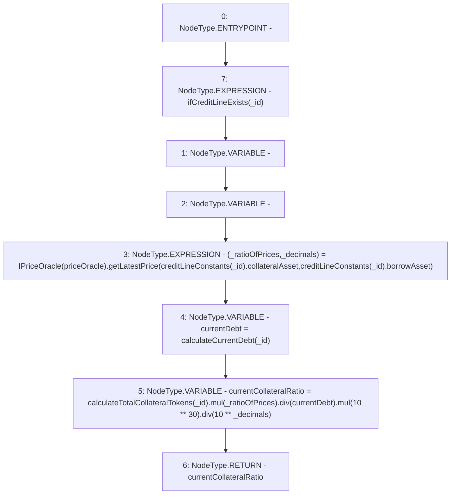

# Context: CreditLine.calculateCurrentCollateralRatio

**Contract:** `CreditLine` (Inherits: OwnableUpgradeable, ContextUpgradeable, Initializable, ReentrancyGuard)
**Signature:** `calculateCurrentCollateralRatio(uint256) returns (uint256)`
**Method Selector ID:** `0x06c6a002`
**Visibility:** `public`
**Environment-Free:** `No (reads EVM state context)`
**Modifiers:**
- `ifCreditLineExists`
  ```solidity
  modifier ifCreditLineExists(uint256 _id) {
          require(creditLineVariables[_id].status != CreditLineStatus.NOT_CREATED, 'Credit line does not exist');
          _;
      }
  ```

### State Variables Interaction
- **Reads:** creditLineConstants, priceOracle
- **Writes:** None

### Environment & Verification Flags
- **Uses Foundry Cheatcodes:** No
- **Has Echidna Properties:** No

### Internal Calls Tree
- None

### External Calls / Value Transfers
- `IPriceOracle.TUPLE_11(uint256,uint256) = HIGH_LEVEL_CALL, dest:TMP_1236(IPriceOracle), function:getLatestPrice, arguments:['REF_379', 'REF_381']  `
- `SafeMath.TMP_1239(uint256) = LIBRARY_CALL, dest:SafeMath, function:SafeMath.mul(uint256,uint256), arguments:['TMP_1238', '_ratioOfPrices'] `
- `SafeMath.TMP_1240(uint256) = LIBRARY_CALL, dest:SafeMath, function:SafeMath.div(uint256,uint256), arguments:['TMP_1239', 'currentDebt'] `
- `SafeMath.TMP_1244(uint256) = LIBRARY_CALL, dest:SafeMath, function:SafeMath.div(uint256,uint256), arguments:['TMP_1242', 'TMP_1243'] `
- `SafeMath.TMP_1242(uint256) = LIBRARY_CALL, dest:SafeMath, function:SafeMath.mul(uint256,uint256), arguments:['TMP_1240', 'TMP_1241'] `

### Control Flow Graph (CFG)


### Source Mapping
Declared in: `contracts/CreditLine/CreditLine.sol` on lines **868** to **880**

```solidity
    function calculateCurrentCollateralRatio(uint256 _id) public ifCreditLineExists(_id) returns (uint256) {
        (uint256 _ratioOfPrices, uint256 _decimals) = IPriceOracle(priceOracle).getLatestPrice(
            creditLineConstants[_id].collateralAsset,
            creditLineConstants[_id].borrowAsset
        );

        uint256 currentDebt = calculateCurrentDebt(_id);
        uint256 currentCollateralRatio = calculateTotalCollateralTokens(_id).mul(_ratioOfPrices).div(currentDebt).mul(10**30).div(
            10**_decimals
        );

        return currentCollateralRatio;
    }

```
