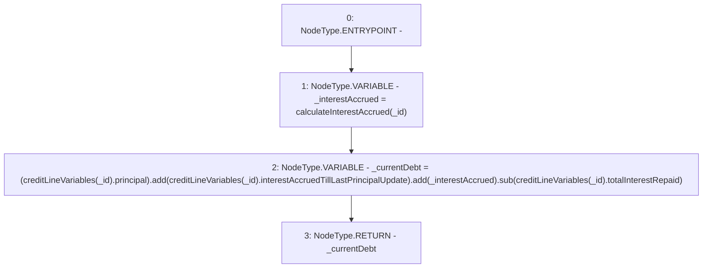

# Context: CreditLine.calculateCurrentDebt

**Contract:** `CreditLine` (Inherits: OwnableUpgradeable, ContextUpgradeable, Initializable, ReentrancyGuard)
**Signature:** `calculateCurrentDebt(uint256) returns (uint256)`
**Method Selector ID:** `0xde056bc9`
**Visibility:** `public`
**Environment-Free:** `No (reads EVM state context)`
**Modifiers:** None

### State Variables Interaction
- **Reads:** creditLineVariables
- **Writes:** None

### Environment & Verification Flags
- **Uses Foundry Cheatcodes:** No
- **Has Echidna Properties:** No

### Internal Calls Tree
- None

### External Calls / Value Transfers
- `SafeMath.TMP_1026(uint256) = LIBRARY_CALL, dest:SafeMath, function:SafeMath.sub(uint256,uint256), arguments:['TMP_1025', 'REF_173'] `
- `SafeMath.TMP_1025(uint256) = LIBRARY_CALL, dest:SafeMath, function:SafeMath.add(uint256,uint256), arguments:['TMP_1024', '_interestAccrued'] `
- `SafeMath.TMP_1024(uint256) = LIBRARY_CALL, dest:SafeMath, function:SafeMath.add(uint256,uint256), arguments:['REF_166', 'REF_169'] `

### Control Flow Graph (CFG)


### Source Mapping
Declared in: `contracts/CreditLine/CreditLine.sol` on lines **420** to **427**

```solidity
    function calculateCurrentDebt(uint256 _id) public view returns (uint256) {
        uint256 _interestAccrued = calculateInterestAccrued(_id);
        uint256 _currentDebt = (creditLineVariables[_id].principal)
            .add(creditLineVariables[_id].interestAccruedTillLastPrincipalUpdate)
            .add(_interestAccrued)
            .sub(creditLineVariables[_id].totalInterestRepaid);
        return _currentDebt;
    }

```
