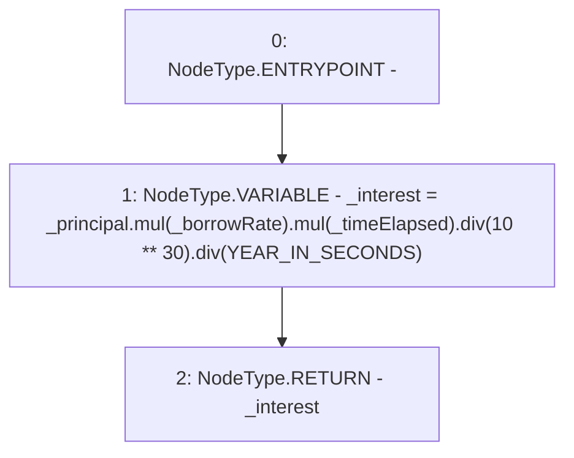

# Context: CreditLine.calculateInterest

**Contract:** `CreditLine` (Inherits: OwnableUpgradeable, ContextUpgradeable, Initializable, ReentrancyGuard)
**Signature:** `calculateInterest(uint256,uint256,uint256) returns (uint256)`
**Method Selector ID:** `0x05e1bd8c`
**Visibility:** `public`
**Environment-Free:** `Yes`
**Modifiers:** None

### State Variables Interaction
- **Reads:** YEAR_IN_SECONDS
- **Writes:** None

### Environment & Verification Flags
- **Uses Foundry Cheatcodes:** No
- **Has Echidna Properties:** No

### Internal Calls Tree
- None

### External Calls / Value Transfers
- `SafeMath.TMP_1019(uint256) = LIBRARY_CALL, dest:SafeMath, function:SafeMath.div(uint256,uint256), arguments:['TMP_1018', 'YEAR_IN_SECONDS'] `
- `SafeMath.TMP_1016(uint256) = LIBRARY_CALL, dest:SafeMath, function:SafeMath.mul(uint256,uint256), arguments:['TMP_1015', '_timeElapsed'] `
- `SafeMath.TMP_1018(uint256) = LIBRARY_CALL, dest:SafeMath, function:SafeMath.div(uint256,uint256), arguments:['TMP_1016', 'TMP_1017'] `
- `SafeMath.TMP_1015(uint256) = LIBRARY_CALL, dest:SafeMath, function:SafeMath.mul(uint256,uint256), arguments:['_principal', '_borrowRate'] `

### Control Flow Graph (CFG)


### Source Mapping
Declared in: `contracts/CreditLine/CreditLine.sol` on lines **391** to **399**

```solidity
    function calculateInterest(
        uint256 _principal,
        uint256 _borrowRate,
        uint256 _timeElapsed
    ) public pure returns (uint256) {
        uint256 _interest = _principal.mul(_borrowRate).mul(_timeElapsed).div(10**30).div(YEAR_IN_SECONDS);

        return _interest;
    }

```
