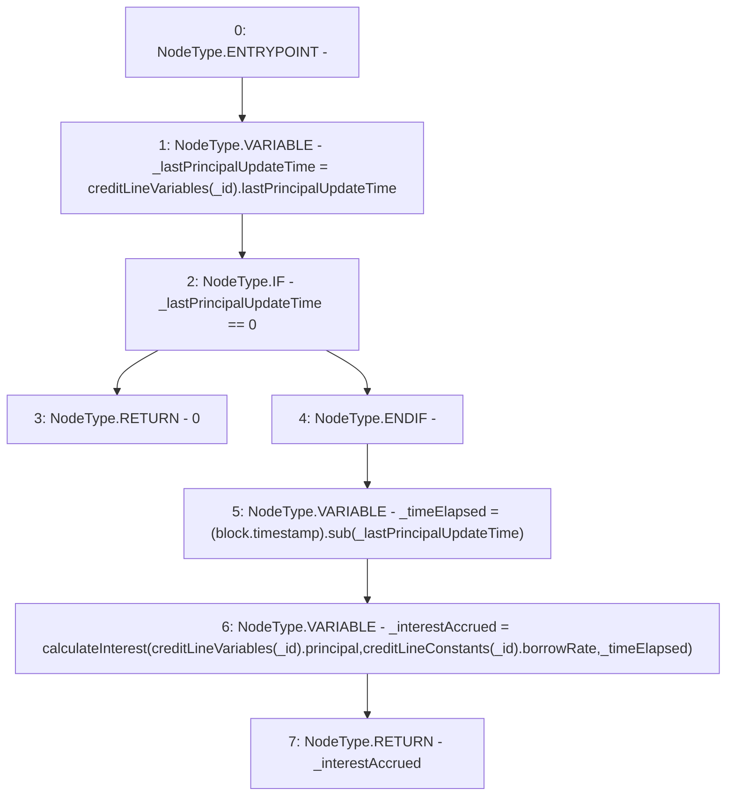

# Context: CreditLine.calculateInterestAccrued

**Contract:** `CreditLine` (Inherits: OwnableUpgradeable, ContextUpgradeable, Initializable, ReentrancyGuard)
**Signature:** `calculateInterestAccrued(uint256) returns (uint256)`
**Method Selector ID:** `0x54a26830`
**Visibility:** `public`
**Environment-Free:** `No (reads EVM state context)`
**Modifiers:** None

### State Variables Interaction
- **Reads:** creditLineConstants, creditLineVariables
- **Writes:** None

### Environment & Verification Flags
- **Uses Foundry Cheatcodes:** No
- **Has Echidna Properties:** No

### Internal Calls Tree
- None

### External Calls / Value Transfers
- `SafeMath.TMP_1021(uint256) = LIBRARY_CALL, dest:SafeMath, function:SafeMath.sub(uint256,uint256), arguments:['block.timestamp', '_lastPrincipalUpdateTime'] `

### Control Flow Graph (CFG)


### Source Mapping
Declared in: `contracts/CreditLine/CreditLine.sol` on lines **407** to **413**

```solidity
    function calculateInterestAccrued(uint256 _id) public view returns (uint256) {
        uint256 _lastPrincipalUpdateTime = creditLineVariables[_id].lastPrincipalUpdateTime;
        if (_lastPrincipalUpdateTime == 0) return 0;
        uint256 _timeElapsed = (block.timestamp).sub(_lastPrincipalUpdateTime);
        uint256 _interestAccrued = calculateInterest(creditLineVariables[_id].principal, creditLineConstants[_id].borrowRate, _timeElapsed);
        return _interestAccrued;
    }

```
