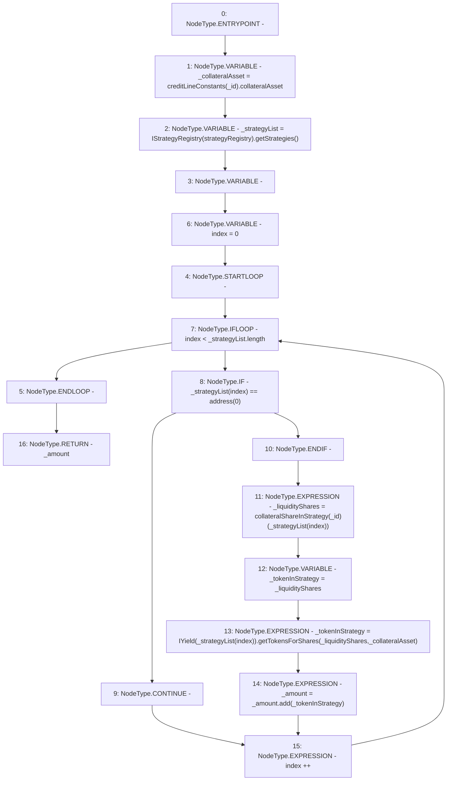

# Context: CreditLine.calculateTotalCollateralTokens

**Contract:** `CreditLine` (Inherits: OwnableUpgradeable, ContextUpgradeable, Initializable, ReentrancyGuard)
**Signature:** `calculateTotalCollateralTokens(uint256) returns (uint256)`
**Method Selector ID:** `0x8878e26c`
**Visibility:** `public`
**Environment-Free:** `Yes`
**Modifiers:** None

### State Variables Interaction
- **Reads:** collateralShareInStrategy, creditLineConstants, strategyRegistry
- **Writes:** None

### Environment & Verification Flags
- **Uses Foundry Cheatcodes:** No
- **Has Echidna Properties:** No

### Internal Calls Tree
- None

### External Calls / Value Transfers
- `IYield.TMP_1252(uint256) = HIGH_LEVEL_CALL, dest:TMP_1251(IYield), function:getTokensForShares, arguments:['_liquidityShares', '_collateralAsset']  `
- `SafeMath.TMP_1253(uint256) = LIBRARY_CALL, dest:SafeMath, function:SafeMath.add(uint256,uint256), arguments:['_amount', '_tokenInStrategy'] `
- `IStrategyRegistry.TMP_1247(address[]) = HIGH_LEVEL_CALL, dest:TMP_1246(IStrategyRegistry), function:getStrategies, arguments:[]  `

### Control Flow Graph (CFG)


### Source Mapping
Declared in: `contracts/CreditLine/CreditLine.sol` on lines **888** to **902**

```solidity
    function calculateTotalCollateralTokens(uint256 _id) public returns (uint256 _amount) {
        address _collateralAsset = creditLineConstants[_id].collateralAsset;
        address[] memory _strategyList = IStrategyRegistry(strategyRegistry).getStrategies();
        uint256 _liquidityShares;
        for (uint256 index = 0; index < _strategyList.length; index++) {
            if (_strategyList[index] == address(0)) {
                continue;
            }
            _liquidityShares = collateralShareInStrategy[_id][_strategyList[index]];
            uint256 _tokenInStrategy = _liquidityShares;
            _tokenInStrategy = IYield(_strategyList[index]).getTokensForShares(_liquidityShares, _collateralAsset);

            _amount = _amount.add(_tokenInStrategy);
        }
    }

```
