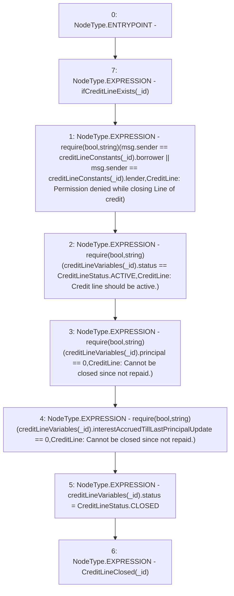

# Context: CreditLine.close

**Contract:** `CreditLine` (Inherits: OwnableUpgradeable, ContextUpgradeable, Initializable, ReentrancyGuard)
**Signature:** `close(uint256)`
**Method Selector ID:** `0x0aebeb4e`
**Visibility:** `external`
**Environment-Free:** `No (reads EVM state context)`
**Modifiers:**
- `ifCreditLineExists`
  ```solidity
  modifier ifCreditLineExists(uint256 _id) {
          require(creditLineVariables[_id].status != CreditLineStatus.NOT_CREATED, 'Credit line does not exist');
          _;
      }
  ```

### State Variables Interaction
- **Reads:** creditLineConstants, creditLineVariables
- **Writes:** creditLineVariables

### Assertion Checks & Business Requirements
- require/assert: `require(bool,string)(msg.sender == creditLineConstants[_id].borrower || msg.sender == creditLineConstants[_id].lender,CreditLine: Permission denied while closing Line of credit)`
- require/assert: `require(bool,string)(creditLineVariables[_id].status == CreditLineStatus.ACTIVE,CreditLine: Credit line should be active.)`
- require/assert: `require(bool,string)(creditLineVariables[_id].principal == 0,CreditLine: Cannot be closed since not repaid.)`
- require/assert: `require(bool,string)(creditLineVariables[_id].interestAccruedTillLastPrincipalUpdate == 0,CreditLine: Cannot be closed since not repaid.)`

### Environment & Verification Flags
- **Uses Foundry Cheatcodes:** No
- **Has Echidna Properties:** No

### Internal Calls Tree
- None

### External Calls / Value Transfers
- None

### Control Flow Graph (CFG)


### Source Mapping
Declared in: `contracts/CreditLine/CreditLine.sol` on lines **849** to **859**

```solidity
    function close(uint256 _id) external ifCreditLineExists(_id) {
        require(
            msg.sender == creditLineConstants[_id].borrower || msg.sender == creditLineConstants[_id].lender,
            'CreditLine: Permission denied while closing Line of credit'
        );
        require(creditLineVariables[_id].status == CreditLineStatus.ACTIVE, 'CreditLine: Credit line should be active.');
        require(creditLineVariables[_id].principal == 0, 'CreditLine: Cannot be closed since not repaid.');
        require(creditLineVariables[_id].interestAccruedTillLastPrincipalUpdate == 0, 'CreditLine: Cannot be closed since not repaid.');
        creditLineVariables[_id].status = CreditLineStatus.CLOSED;
        emit CreditLineClosed(_id);
    }

```
