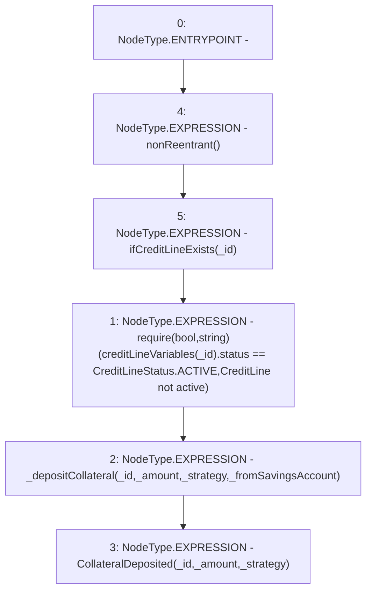

# Context: CreditLine.depositCollateral

**Contract:** `CreditLine` (Inherits: OwnableUpgradeable, ContextUpgradeable, Initializable, ReentrancyGuard)
**Signature:** `depositCollateral(uint256,uint256,address,bool)`
**Method Selector ID:** `0xfb6412a3`
**Visibility:** `external`
**Environment-Free:** `No (reads EVM state context)`
**Modifiers:**
- `nonReentrant`
  ```solidity
  modifier nonReentrant() {
          // On the first call to nonReentrant, _notEntered will be true
          require(_status != _ENTERED, "ReentrancyGuard: reentrant call");
  
          // Any calls to nonReentrant after this point will fail
          _status = _ENTERED;
  
          _;
  
          // By storing the original value once again, a refund is triggered (see
          // https://eips.ethereum.org/EIPS/eip-2200)
          _status = _NOT_ENTERED;
      }
  ```
- `ifCreditLineExists`
  ```solidity
  modifier ifCreditLineExists(uint256 _id) {
          require(creditLineVariables[_id].status != CreditLineStatus.NOT_CREATED, 'Credit line does not exist');
          _;
      }
  ```

### State Variables Interaction
- **Reads:** creditLineVariables
- **Writes:** None

### Assertion Checks & Business Requirements
- require/assert: `require(bool,string)(creditLineVariables[_id].status == CreditLineStatus.ACTIVE,CreditLine not active)`

### Environment & Verification Flags
- **Uses Foundry Cheatcodes:** No
- **Has Echidna Properties:** No

### Internal Calls Tree
- None

### External Calls / Value Transfers
- None

### Control Flow Graph (CFG)


### Source Mapping
Declared in: `contracts/CreditLine/CreditLine.sol` on lines **620** to **629**

```solidity
    function depositCollateral(
        uint256 _id,
        uint256 _amount,
        address _strategy,
        bool _fromSavingsAccount
    ) external payable nonReentrant ifCreditLineExists(_id) {
        require(creditLineVariables[_id].status == CreditLineStatus.ACTIVE, 'CreditLine not active');
        _depositCollateral(_id, _amount, _strategy, _fromSavingsAccount);
        emit CollateralDeposited(_id, _amount, _strategy);
    }

```
