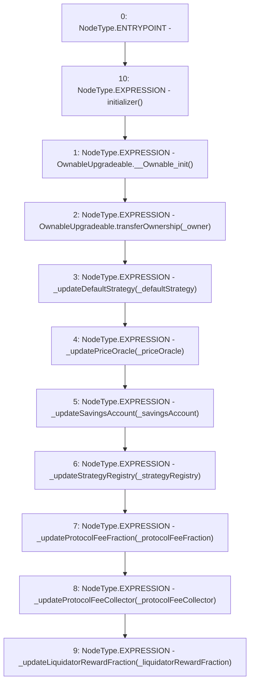

# Context: CreditLine.initialize

**Contract:** `CreditLine` (Inherits: OwnableUpgradeable, ContextUpgradeable, Initializable, ReentrancyGuard)
**Signature:** `initialize(address,address,address,address,address,uint256,address,uint256)`
**Method Selector ID:** `0x93a01b0b`
**Visibility:** `external`
**Environment-Free:** `No (reads EVM state context)`
**Modifiers:**
- `initializer`
  ```solidity
  modifier initializer() {
          require(_initializing || _isConstructor() || !_initialized, "Initializable: contract is already initialized");
  
          bool isTopLevelCall = !_initializing;
          if (isTopLevelCall) {
              _initializing = true;
              _initialized = true;
          }
  
          _;
  
          if (isTopLevelCall) {
              _initializing = false;
          }
      }
  ```

### State Variables Interaction
- **Reads:** None
- **Writes:** None

### Environment & Verification Flags
- **Uses Foundry Cheatcodes:** No
- **Has Echidna Properties:** No

### Internal Calls Tree
- None

### External Calls / Value Transfers
- None

### Control Flow Graph (CFG)


### Source Mapping
Declared in: `contracts/CreditLine/CreditLine.sol` on lines **262** to **282**

```solidity
    function initialize(
        address _defaultStrategy,
        address _priceOracle,
        address _savingsAccount,
        address _strategyRegistry,
        address _owner,
        uint256 _protocolFeeFraction,
        address _protocolFeeCollector,
        uint256 _liquidatorRewardFraction
    ) external initializer {
        OwnableUpgradeable.__Ownable_init();
        OwnableUpgradeable.transferOwnership(_owner);

        _updateDefaultStrategy(_defaultStrategy);
        _updatePriceOracle(_priceOracle);
        _updateSavingsAccount(_savingsAccount);
        _updateStrategyRegistry(_strategyRegistry);
        _updateProtocolFeeFraction(_protocolFeeFraction);
        _updateProtocolFeeCollector(_protocolFeeCollector);
        _updateLiquidatorRewardFraction(_liquidatorRewardFraction);
    }

```
