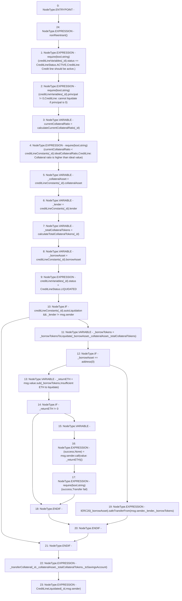

# Context: CreditLine.liquidate

**Contract:** `CreditLine` (Inherits: OwnableUpgradeable, ContextUpgradeable, Initializable, ReentrancyGuard)
**Signature:** `liquidate(uint256,bool)`
**Method Selector ID:** `0x2758db0c`
**Visibility:** `external`
**Environment-Free:** `No (reads EVM state context)`
**Modifiers:**
- `nonReentrant`
  ```solidity
  modifier nonReentrant() {
          // On the first call to nonReentrant, _notEntered will be true
          require(_status != _ENTERED, "ReentrancyGuard: reentrant call");
  
          // Any calls to nonReentrant after this point will fail
          _status = _ENTERED;
  
          _;
  
          // By storing the original value once again, a refund is triggered (see
          // https://eips.ethereum.org/EIPS/eip-2200)
          _status = _NOT_ENTERED;
      }
  ```

### State Variables Interaction
- **Reads:** creditLineConstants, creditLineVariables
- **Writes:** creditLineVariables

### Assertion Checks & Business Requirements
- require/assert: `require(bool,string)(creditLineVariables[_id].status == CreditLineStatus.ACTIVE,CreditLine: Credit line should be active.)`
- require/assert: `require(bool,string)(creditLineVariables[_id].principal != 0,CreditLine: cannot liquidate if principal is 0)`
- require/assert: `require(bool,string)(currentCollateralRatio < creditLineConstants[_id].idealCollateralRatio,CreditLine: Collateral ratio is higher than ideal value)`
- require/assert: `require(bool,string)(success,Transfer fail)`

### Environment & Verification Flags
- **Uses Foundry Cheatcodes:** No
- **Has Echidna Properties:** No

### Internal Calls Tree
- None

### External Calls / Value Transfers
- `SafeMath.TMP_1309(uint256) = LIBRARY_CALL, dest:SafeMath, function:SafeMath.sub(uint256,uint256,string), arguments:['msg.value', '_borrowTokens', 'Insufficient ETH to liquidate'] `
- `SafeERC20.LIBRARY_CALL, dest:SafeERC20, function:SafeERC20.safeTransferFrom(IERC20,address,address,uint256), arguments:['TMP_1312', 'msg.sender', '_lender', '_borrowTokens'] `
- `low-level-call`

### Control Flow Graph (CFG)


### Source Mapping
Declared in: `contracts/CreditLine/CreditLine.sol` on lines **996** to **1029**

```solidity
    function liquidate(uint256 _id, bool _toSavingsAccount) external payable nonReentrant {
        require(creditLineVariables[_id].status == CreditLineStatus.ACTIVE, 'CreditLine: Credit line should be active.');
        require(creditLineVariables[_id].principal != 0, 'CreditLine: cannot liquidate if principal is 0');

        uint256 currentCollateralRatio = calculateCurrentCollateralRatio(_id);
        require(
            currentCollateralRatio < creditLineConstants[_id].idealCollateralRatio,
            'CreditLine: Collateral ratio is higher than ideal value'
        );

        address _collateralAsset = creditLineConstants[_id].collateralAsset;
        address _lender = creditLineConstants[_id].lender;
        uint256 _totalCollateralTokens = calculateTotalCollateralTokens(_id);
        address _borrowAsset = creditLineConstants[_id].borrowAsset;

        creditLineVariables[_id].status = CreditLineStatus.LIQUIDATED;

        if (creditLineConstants[_id].autoLiquidation && _lender != msg.sender) {
            uint256 _borrowTokens = _borrowTokensToLiquidate(_borrowAsset, _collateralAsset, _totalCollateralTokens);
            if (_borrowAsset == address(0)) {
                uint256 _returnETH = msg.value.sub(_borrowTokens, 'Insufficient ETH to liquidate');
                if (_returnETH != 0) {
                    (bool success, ) = msg.sender.call{value: _returnETH}('');
                    require(success, 'Transfer fail');
                }
            } else {
                IERC20(_borrowAsset).safeTransferFrom(msg.sender, _lender, _borrowTokens);
            }
        }

        _transferCollateral(_id, _collateralAsset, _totalCollateralTokens, _toSavingsAccount);

        emit CreditLineLiquidated(_id, msg.sender);
    }

```
