# Context: CreditLine.repay

**Contract:** `CreditLine` (Inherits: OwnableUpgradeable, ContextUpgradeable, Initializable, ReentrancyGuard)
**Signature:** `repay(uint256,uint256,bool)`
**Method Selector ID:** `0x6fd52298`
**Visibility:** `external`
**Environment-Free:** `No (reads EVM state context)`
**Modifiers:**
- `nonReentrant`
  ```solidity
  modifier nonReentrant() {
          // On the first call to nonReentrant, _notEntered will be true
          require(_status != _ENTERED, "ReentrancyGuard: reentrant call");
  
          // Any calls to nonReentrant after this point will fail
          _status = _ENTERED;
  
          _;
  
          // By storing the original value once again, a refund is triggered (see
          // https://eips.ethereum.org/EIPS/eip-2200)
          _status = _NOT_ENTERED;
      }
  ```

### State Variables Interaction
- **Reads:** creditLineConstants, creditLineVariables
- **Writes:** creditLineVariables

### Assertion Checks & Business Requirements
- require/assert: `require(bool,string)(creditLineVariables[_id].status == CreditLineStatus.ACTIVE,CreditLine: The credit line is not yet active.)`
- require/assert: `require(bool,string)(creditLineConstants[_id].lender != msg.sender,Lender cant repay)`

### Environment & Verification Flags
- **Uses Foundry Cheatcodes:** No
- **Has Echidna Properties:** No

### Internal Calls Tree
- None

### External Calls / Value Transfers
- `SafeMath.TMP_1209(uint256) = LIBRARY_CALL, dest:SafeMath, function:SafeMath.add(uint256,uint256), arguments:['REF_332', '_interestSincePrincipalUpdate'] `
- `SafeMath.TMP_1217(uint256) = LIBRARY_CALL, dest:SafeMath, function:SafeMath.sub(uint256,uint256), arguments:['_amount', '_interestToPay'] `
- `SafeMath.TMP_1210(uint256) = LIBRARY_CALL, dest:SafeMath, function:SafeMath.sub(uint256,uint256), arguments:['_totalInterestAccrued', 'REF_336'] `
- `SafeMath.TMP_1218(uint256) = LIBRARY_CALL, dest:SafeMath, function:SafeMath.add(uint256,uint256), arguments:['REF_353', '_amount'] `
- `SafeMath.TMP_1211(uint256) = LIBRARY_CALL, dest:SafeMath, function:SafeMath.add(uint256,uint256), arguments:['_interestToPay', 'REF_339'] `
- `SafeMath.TMP_1216(uint256) = LIBRARY_CALL, dest:SafeMath, function:SafeMath.sub(uint256,uint256), arguments:['_totalCurrentDebt', '_amount'] `

### Control Flow Graph (CFG)

```mermaid
flowchart TD
    Node_0["0: NodeType.ENTRYPOINT - "]
    Node_0 --> Node_25
    Node_1["1: NodeType.EXPRESSION - require(bool,string)(creditLineVariables(_id).status == CreditLineStatus.ACTIVE,CreditLine: The credit line is not yet active.)"]
    Node_1 --> Node_2
    Node_2["2: NodeType.EXPRESSION - require(bool,string)(creditLineConstants(_id).lender != msg.sender,Lender cant repay)"]
    Node_2 --> Node_3
    Node_3["3: NodeType.VARIABLE - _interestSincePrincipalUpdate = calculateInterestAccrued(_id)"]
    Node_3 --> Node_4
    Node_4["4: NodeType.VARIABLE - _totalInterestAccrued = (creditLineVariables(_id).interestAccruedTillLastPrincipalUpdate).add(_interestSincePrincipalUpdate)"]
    Node_4 --> Node_5
    Node_5["5: NodeType.VARIABLE - _interestToPay = _totalInterestAccrued.sub(creditLineVariables(_id).totalInterestRepaid)"]
    Node_5 --> Node_6
    Node_6["6: NodeType.VARIABLE - _totalCurrentDebt = _interestToPay.add(creditLineVariables(_id).principal)"]
    Node_6 --> Node_7
    Node_7["7: NodeType.VARIABLE - _principalPaid = 0"]
    Node_7 --> Node_8
    Node_8["8: NodeType.IF - _amount >= _totalCurrentDebt"]
    Node_8 --> Node_9
    Node_8 --> Node_11
    Node_9["9: NodeType.EXPRESSION - _amount = _totalCurrentDebt"]
    Node_9 --> Node_10
    Node_10["10: NodeType.EXPRESSION - CompleteCreditLineRepaid(_id,_amount)"]
    Node_10 --> Node_12
    Node_11["11: NodeType.EXPRESSION - PartialCreditLineRepaid(_id,_amount)"]
    Node_11 --> Node_12
    Node_12["12: NodeType.ENDIF - "]
    Node_12 --> Node_13
    Node_13["13: NodeType.IF - _amount > _interestToPay"]
    Node_13 --> Node_14
    Node_13 --> Node_19
    Node_14["14: NodeType.EXPRESSION - creditLineVariables(_id).principal = _totalCurrentDebt.sub(_amount)"]
    Node_14 --> Node_15
    Node_15["15: NodeType.EXPRESSION - creditLineVariables(_id).interestAccruedTillLastPrincipalUpdate = _totalInterestAccrued"]
    Node_15 --> Node_16
    Node_16["16: NodeType.EXPRESSION - creditLineVariables(_id).lastPrincipalUpdateTime = block.timestamp"]
    Node_16 --> Node_17
    Node_17["17: NodeType.EXPRESSION - creditLineVariables(_id).totalInterestRepaid = _totalInterestAccrued"]
    Node_17 --> Node_18
    Node_18["18: NodeType.EXPRESSION - _principalPaid = _amount.sub(_interestToPay)"]
    Node_18 --> Node_20
    Node_19["19: NodeType.EXPRESSION - creditLineVariables(_id).totalInterestRepaid = creditLineVariables(_id).totalInterestRepaid.add(_amount)"]
    Node_19 --> Node_20
    Node_20["20: NodeType.ENDIF - "]
    Node_20 --> Node_21
    Node_21["21: NodeType.EXPRESSION - _repay(_id,_amount,_fromSavingsAccount,_principalPaid)"]
    Node_21 --> Node_22
    Node_22["22: NodeType.IF - creditLineVariables(_id).principal == 0"]
    Node_22 --> Node_23
    Node_22 --> Node_24
    Node_23["23: NodeType.EXPRESSION - _resetCreditLine(_id)"]
    Node_23 --> Node_24
    Node_24["24: NodeType.ENDIF - "]
    Node_25["25: NodeType.EXPRESSION - nonReentrant()"]
    Node_25 --> Node_1
```


### Source Mapping
Declared in: `contracts/CreditLine/CreditLine.sol` on lines **798** to **836**

```solidity
    function repay(
        uint256 _id,
        uint256 _amount,
        bool _fromSavingsAccount
    ) external payable nonReentrant {
        require(creditLineVariables[_id].status == CreditLineStatus.ACTIVE, 'CreditLine: The credit line is not yet active.');
        require(creditLineConstants[_id].lender != msg.sender, 'Lender cant repay');

        uint256 _interestSincePrincipalUpdate = calculateInterestAccrued(_id);
        uint256 _totalInterestAccrued = (creditLineVariables[_id].interestAccruedTillLastPrincipalUpdate).add(
            _interestSincePrincipalUpdate
        );
        uint256 _interestToPay = _totalInterestAccrued.sub(creditLineVariables[_id].totalInterestRepaid);
        uint256 _totalCurrentDebt = _interestToPay.add(creditLineVariables[_id].principal);
        uint256 _principalPaid = 0;

        if (_amount >= _totalCurrentDebt) {
            _amount = _totalCurrentDebt;
            emit CompleteCreditLineRepaid(_id, _amount);
        } else {
            emit PartialCreditLineRepaid(_id, _amount);
        }

        if (_amount > _interestToPay) {
            creditLineVariables[_id].principal = _totalCurrentDebt.sub(_amount);
            creditLineVariables[_id].interestAccruedTillLastPrincipalUpdate = _totalInterestAccrued;
            creditLineVariables[_id].lastPrincipalUpdateTime = block.timestamp;
            creditLineVariables[_id].totalInterestRepaid = _totalInterestAccrued;
            _principalPaid = _amount.sub(_interestToPay);
        } else {
            creditLineVariables[_id].totalInterestRepaid = creditLineVariables[_id].totalInterestRepaid.add(_amount);
        }

        _repay(_id, _amount, _fromSavingsAccount, _principalPaid);

        if (creditLineVariables[_id].principal == 0) {
            _resetCreditLine(_id);
        }
    }

```
