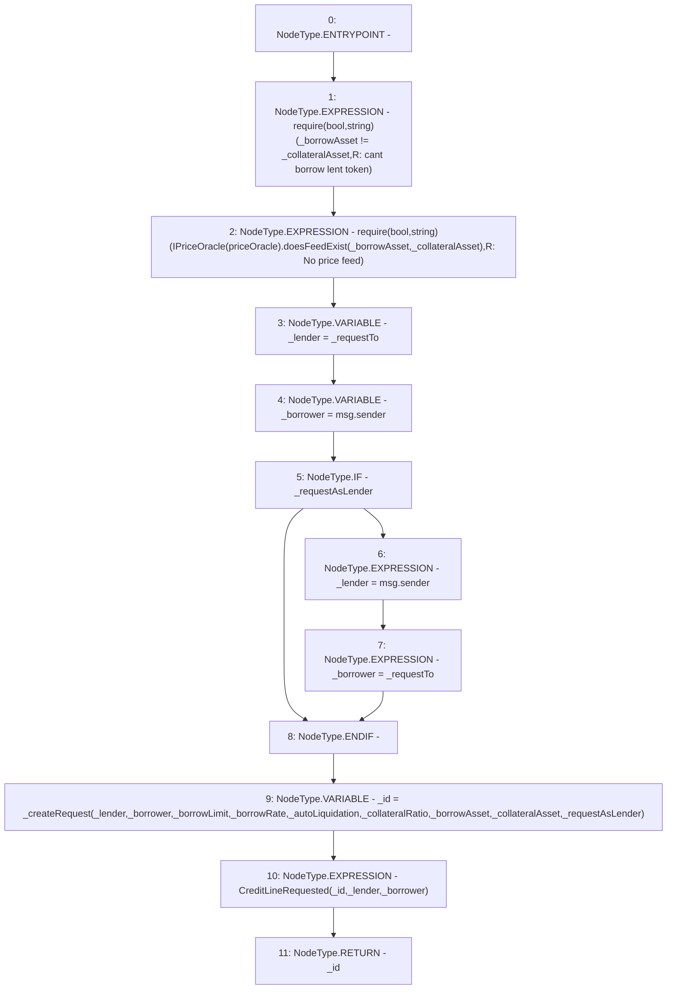

# Context: CreditLine.request

**Contract:** `CreditLine` (Inherits: OwnableUpgradeable, ContextUpgradeable, Initializable, ReentrancyGuard)
**Signature:** `request(address,uint256,uint256,bool,uint256,address,address,bool) returns (uint256)`
**Method Selector ID:** `0x1c1e0e58`
**Visibility:** `external`
**Environment-Free:** `No (reads EVM state context)`
**Modifiers:** None

### State Variables Interaction
- **Reads:** priceOracle
- **Writes:** None

### Assertion Checks & Business Requirements
- require/assert: `require(bool,string)(_borrowAsset != _collateralAsset,R: cant borrow lent token)`
- require/assert: `require(bool,string)(IPriceOracle(priceOracle).doesFeedExist(_borrowAsset,_collateralAsset),R: No price feed)`

### Environment & Verification Flags
- **Uses Foundry Cheatcodes:** No
- **Has Echidna Properties:** No

### Internal Calls Tree
- None

### External Calls / Value Transfers
- `IPriceOracle.TMP_1073(bool) = HIGH_LEVEL_CALL, dest:TMP_1072(IPriceOracle), function:doesFeedExist, arguments:['_borrowAsset', '_collateralAsset']  `

### Control Flow Graph (CFG)


### Source Mapping
Declared in: `contracts/CreditLine/CreditLine.sol` on lines **526** to **560**

```solidity
    function request(
        address _requestTo,
        uint256 _borrowLimit,
        uint256 _borrowRate,
        bool _autoLiquidation,
        uint256 _collateralRatio,
        address _borrowAsset,
        address _collateralAsset,
        bool _requestAsLender
    ) external returns (uint256) {
        require(_borrowAsset != _collateralAsset, 'R: cant borrow lent token');
        require(IPriceOracle(priceOracle).doesFeedExist(_borrowAsset, _collateralAsset), 'R: No price feed');

        address _lender = _requestTo;
        address _borrower = msg.sender;
        if (_requestAsLender) {
            _lender = msg.sender;
            _borrower = _requestTo;
        }

        uint256 _id = _createRequest(
            _lender,
            _borrower,
            _borrowLimit,
            _borrowRate,
            _autoLiquidation,
            _collateralRatio,
            _borrowAsset,
            _collateralAsset,
            _requestAsLender
        );

        emit CreditLineRequested(_id, _lender, _borrower);
        return _id;
    }

```
