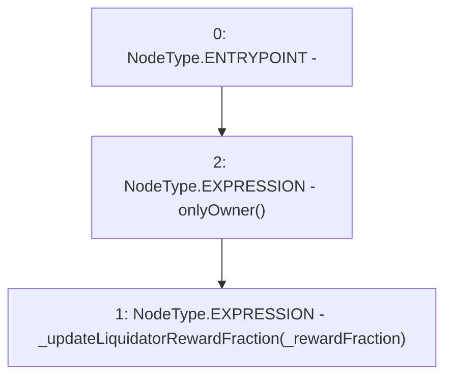

# Context: CreditLine.updateLiquidatorRewardFraction

**Contract:** `CreditLine` (Inherits: OwnableUpgradeable, ContextUpgradeable, Initializable, ReentrancyGuard)
**Signature:** `updateLiquidatorRewardFraction(uint256)`
**Method Selector ID:** `0x112dc9dc`
**Visibility:** `external`
**Environment-Free:** `No (reads EVM state context)`
**Modifiers:**
- `onlyOwner`
  ```solidity
  modifier onlyOwner() {
          require(owner() == _msgSender(), "Ownable: caller is not the owner");
          _;
      }
  ```

### State Variables Interaction
- **Reads:** None
- **Writes:** None

### Environment & Verification Flags
- **Uses Foundry Cheatcodes:** No
- **Has Echidna Properties:** No

### Internal Calls Tree
- None

### External Calls / Value Transfers
- None

### Control Flow Graph (CFG)


### Source Mapping
Declared in: `contracts/CreditLine/CreditLine.sol` on lines **375** to **377**

```solidity
    function updateLiquidatorRewardFraction(uint256 _rewardFraction) external onlyOwner {
        _updateLiquidatorRewardFraction(_rewardFraction);
    }

```
