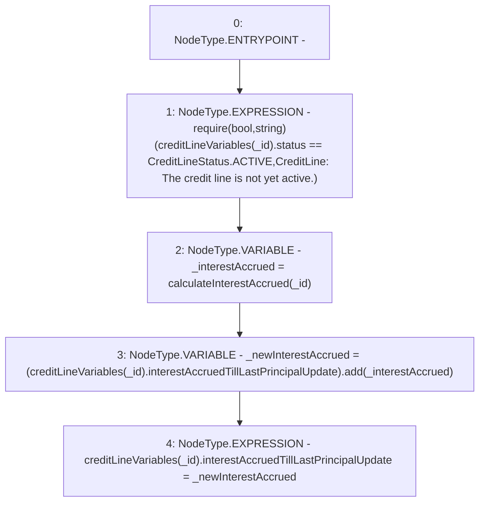

# Context: CreditLine.updateinterestAccruedTillLastPrincipalUpdate

**Contract:** `CreditLine` (Inherits: OwnableUpgradeable, ContextUpgradeable, Initializable, ReentrancyGuard)
**Signature:** `updateinterestAccruedTillLastPrincipalUpdate(uint256)`
**Method Selector ID:** `Internal (No Method ID)`
**Visibility:** `internal`
**Environment-Free:** `No (reads EVM state context)`
**Modifiers:** None

### State Variables Interaction
- **Reads:** creditLineVariables
- **Writes:** creditLineVariables

### Assertion Checks & Business Requirements
- require/assert: `require(bool,string)(creditLineVariables[_id].status == CreditLineStatus.ACTIVE,CreditLine: The credit line is not yet active.)`

### Environment & Verification Flags
- **Uses Foundry Cheatcodes:** No
- **Has Echidna Properties:** No

### Internal Calls Tree
- None

### External Calls / Value Transfers
- `SafeMath.TMP_1046(uint256) = LIBRARY_CALL, dest:SafeMath, function:SafeMath.add(uint256,uint256), arguments:['REF_196', '_interestAccrued'] `

### Control Flow Graph (CFG)


### Source Mapping
Declared in: `contracts/CreditLine/CreditLine.sol` on lines **466** to **472**

```solidity
    function updateinterestAccruedTillLastPrincipalUpdate(uint256 _id) internal {
        require(creditLineVariables[_id].status == CreditLineStatus.ACTIVE, 'CreditLine: The credit line is not yet active.');

        uint256 _interestAccrued = calculateInterestAccrued(_id);
        uint256 _newInterestAccrued = (creditLineVariables[_id].interestAccruedTillLastPrincipalUpdate).add(_interestAccrued);
        creditLineVariables[_id].interestAccruedTillLastPrincipalUpdate = _newInterestAccrued;
    }

```
