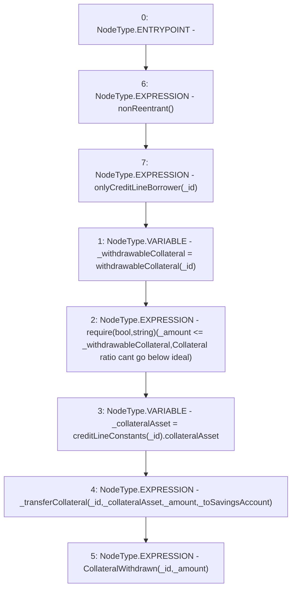

# Context: CreditLine.withdrawCollateral

**Contract:** `CreditLine` (Inherits: OwnableUpgradeable, ContextUpgradeable, Initializable, ReentrancyGuard)
**Signature:** `withdrawCollateral(uint256,uint256,bool)`
**Method Selector ID:** `0x22adad3e`
**Visibility:** `external`
**Environment-Free:** `No (reads EVM state context)`
**Modifiers:**
- `nonReentrant`
  ```solidity
  modifier nonReentrant() {
          // On the first call to nonReentrant, _notEntered will be true
          require(_status != _ENTERED, "ReentrancyGuard: reentrant call");
  
          // Any calls to nonReentrant after this point will fail
          _status = _ENTERED;
  
          _;
  
          // By storing the original value once again, a refund is triggered (see
          // https://eips.ethereum.org/EIPS/eip-2200)
          _status = _NOT_ENTERED;
      }
  ```
- `onlyCreditLineBorrower`
  ```solidity
  modifier onlyCreditLineBorrower(uint256 _id) {
          require(creditLineConstants[_id].borrower == msg.sender, 'Only credit line Borrower can access');
          _;
      }
  ```

### State Variables Interaction
- **Reads:** creditLineConstants
- **Writes:** None

### Assertion Checks & Business Requirements
- require/assert: `require(bool,string)(_amount <= _withdrawableCollateral,Collateral ratio cant go below ideal)`

### Environment & Verification Flags
- **Uses Foundry Cheatcodes:** No
- **Has Echidna Properties:** No

### Internal Calls Tree
- None

### External Calls / Value Transfers
- None

### Control Flow Graph (CFG)


### Source Mapping
Declared in: `contracts/CreditLine/CreditLine.sol` on lines **912** to **922**

```solidity
    function withdrawCollateral(
        uint256 _id,
        uint256 _amount,
        bool _toSavingsAccount
    ) external nonReentrant onlyCreditLineBorrower(_id) {
        uint256 _withdrawableCollateral = withdrawableCollateral(_id);
        require(_amount <= _withdrawableCollateral, 'Collateral ratio cant go below ideal');
        address _collateralAsset = creditLineConstants[_id].collateralAsset;
        _transferCollateral(_id, _collateralAsset, _amount, _toSavingsAccount);
        emit CollateralWithdrawn(_id, _amount);
    }

```
