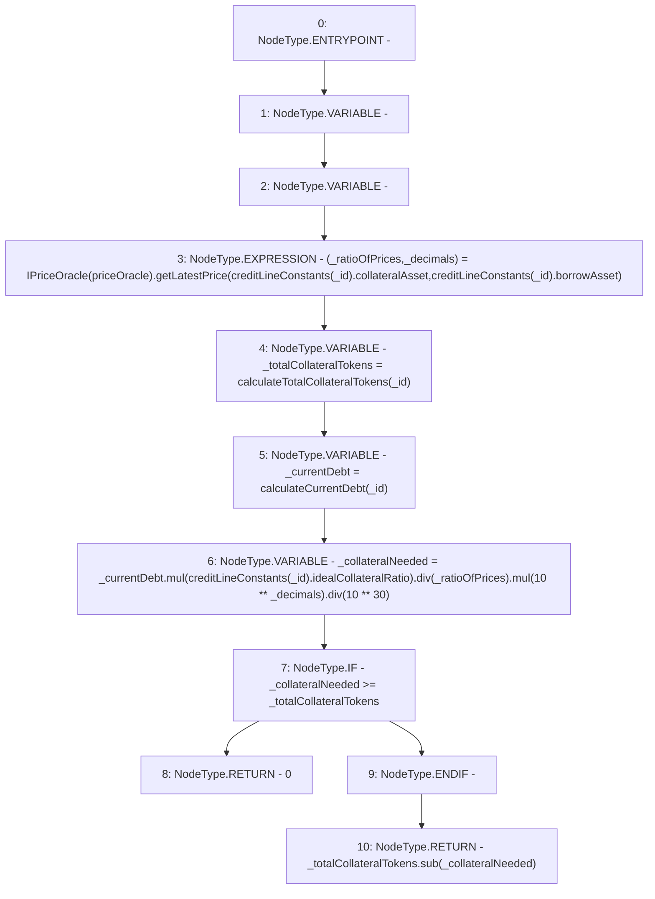

# Context: CreditLine.withdrawableCollateral

**Contract:** `CreditLine` (Inherits: OwnableUpgradeable, ContextUpgradeable, Initializable, ReentrancyGuard)
**Signature:** `withdrawableCollateral(uint256) returns (uint256)`
**Method Selector ID:** `0xd68f2170`
**Visibility:** `public`
**Environment-Free:** `No (reads EVM state context)`
**Modifiers:** None

### State Variables Interaction
- **Reads:** creditLineConstants, priceOracle
- **Writes:** None

### Environment & Verification Flags
- **Uses Foundry Cheatcodes:** No
- **Has Echidna Properties:** No

### Internal Calls Tree
- None

### External Calls / Value Transfers
- `IPriceOracle.TUPLE_12(uint256,uint256) = HIGH_LEVEL_CALL, dest:TMP_1262(IPriceOracle), function:getLatestPrice, arguments:['REF_401', 'REF_403']  `
- `SafeMath.TMP_1272(uint256) = LIBRARY_CALL, dest:SafeMath, function:SafeMath.sub(uint256,uint256), arguments:['_totalCollateralTokens', '_collateralNeeded'] `
- `SafeMath.TMP_1265(uint256) = LIBRARY_CALL, dest:SafeMath, function:SafeMath.mul(uint256,uint256), arguments:['_currentDebt', 'REF_406'] `
- `SafeMath.TMP_1268(uint256) = LIBRARY_CALL, dest:SafeMath, function:SafeMath.mul(uint256,uint256), arguments:['TMP_1266', 'TMP_1267'] `
- `SafeMath.TMP_1266(uint256) = LIBRARY_CALL, dest:SafeMath, function:SafeMath.div(uint256,uint256), arguments:['TMP_1265', '_ratioOfPrices'] `
- `SafeMath.TMP_1270(uint256) = LIBRARY_CALL, dest:SafeMath, function:SafeMath.div(uint256,uint256), arguments:['TMP_1268', 'TMP_1269'] `

### Control Flow Graph (CFG)


### Source Mapping
Declared in: `contracts/CreditLine/CreditLine.sol` on lines **930** to **949**

```solidity
    function withdrawableCollateral(uint256 _id) public returns (uint256) {
        (uint256 _ratioOfPrices, uint256 _decimals) = IPriceOracle(priceOracle).getLatestPrice(
            creditLineConstants[_id].collateralAsset,
            creditLineConstants[_id].borrowAsset
        );

        uint256 _totalCollateralTokens = calculateTotalCollateralTokens(_id);
        uint256 _currentDebt = calculateCurrentDebt(_id);

        uint256 _collateralNeeded = _currentDebt
            .mul(creditLineConstants[_id].idealCollateralRatio)
            .div(_ratioOfPrices)
            .mul(10**_decimals)
            .div(10**30);

        if (_collateralNeeded >= _totalCollateralTokens) {
            return 0;
        }
        return _totalCollateralTokens.sub(_collateralNeeded);
    }

```
