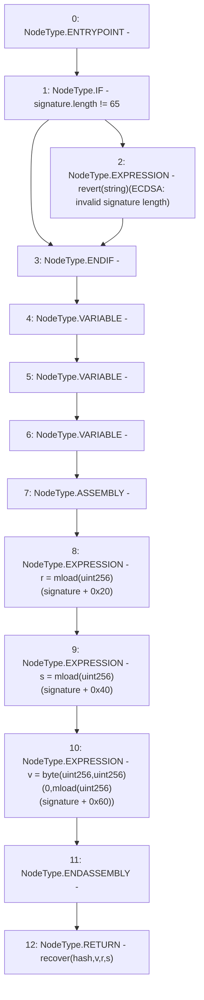

# Context: ECDSA.recover

**Contract:** `ECDSA` (Inherits: None)
**Signature:** `recover(bytes32,bytes) returns (address)`
**Method Selector ID:** `Internal (No Method ID)`
**Visibility:** `internal`
**Environment-Free:** `Yes`
**Modifiers:** None

### State Variables Interaction
- **Reads:** None
- **Writes:** None

### Assertion Checks & Business Requirements
- revert: `revert(string)(ECDSA: invalid signature length)`

### Environment & Verification Flags
- **Uses Foundry Cheatcodes:** No
- **Has Echidna Properties:** No

### Internal Calls Tree
- None

### External Calls / Value Transfers
- None

### Control Flow Graph (CFG)


### Source Mapping
Declared in: `node_modules/@openzeppelin/contracts/cryptography/ECDSA.sol` on lines **26** to **47**

```solidity
    function recover(bytes32 hash, bytes memory signature) internal pure returns (address) {
        // Check the signature length
        if (signature.length != 65) {
            revert("ECDSA: invalid signature length");
        }

        // Divide the signature in r, s and v variables
        bytes32 r;
        bytes32 s;
        uint8 v;

        // ecrecover takes the signature parameters, and the only way to get them
        // currently is to use assembly.
        // solhint-disable-next-line no-inline-assembly
        assembly {
            r := mload(add(signature, 0x20))
            s := mload(add(signature, 0x40))
            v := byte(0, mload(add(signature, 0x60)))
        }

        return recover(hash, v, r, s);
    }

```
