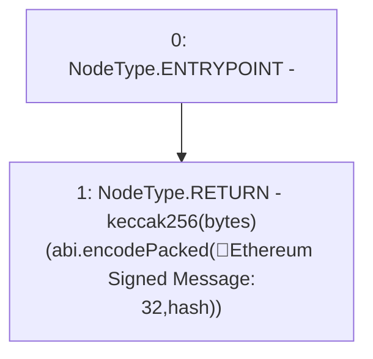

# Context: ECDSA.toEthSignedMessageHash

**Contract:** `ECDSA` (Inherits: None)
**Signature:** `toEthSignedMessageHash(bytes32) returns (bytes32)`
**Method Selector ID:** `Internal (No Method ID)`
**Visibility:** `internal`
**Environment-Free:** `Yes`
**Modifiers:** None

### State Variables Interaction
- **Reads:** None
- **Writes:** None

### Environment & Verification Flags
- **Uses Foundry Cheatcodes:** No
- **Has Echidna Properties:** No

### Internal Calls Tree
- None

### External Calls / Value Transfers
- None

### Control Flow Graph (CFG)


### Source Mapping
Declared in: `node_modules/@openzeppelin/contracts/cryptography/ECDSA.sol` on lines **81** to **85**

```solidity
    function toEthSignedMessageHash(bytes32 hash) internal pure returns (bytes32) {
        // 32 is the length in bytes of hash,
        // enforced by the type signature above
        return keccak256(abi.encodePacked("\x19Ethereum Signed Message:\n32", hash));
    }

```
