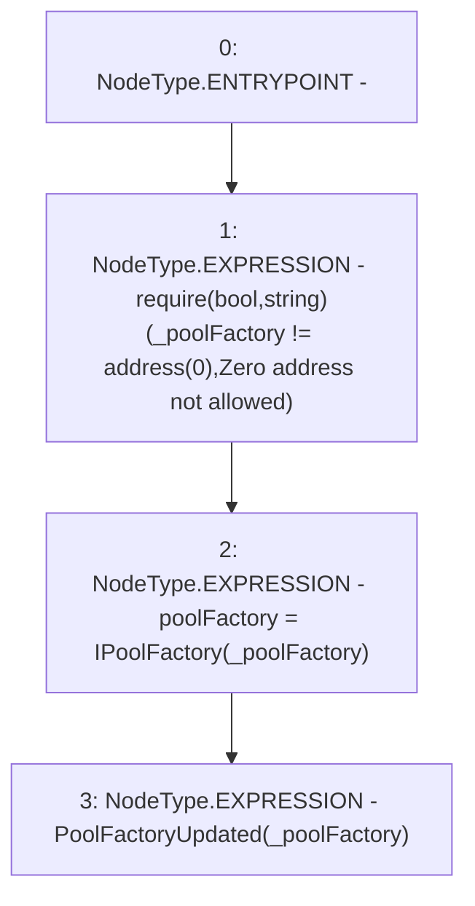

# Context: Extension._updatePoolFactory

**Contract:** `Extension` (Inherits: IExtension, Initializable)
**Signature:** `_updatePoolFactory(address)`
**Method Selector ID:** `Internal (No Method ID)`
**Visibility:** `internal`
**Environment-Free:** `Yes`
**Modifiers:** None

### State Variables Interaction
- **Reads:** None
- **Writes:** poolFactory

### Assertion Checks & Business Requirements
- require/assert: `require(bool,string)(_poolFactory != address(0),Zero address not allowed)`

### Environment & Verification Flags
- **Uses Foundry Cheatcodes:** No
- **Has Echidna Properties:** No

### Internal Calls Tree
- None

### External Calls / Value Transfers
- None

### Control Flow Graph (CFG)


### Source Mapping
Declared in: `contracts/Pool/Extension.sol` on lines **200** to **204**

```solidity
    function _updatePoolFactory(address _poolFactory) internal {
        require(_poolFactory != address(0), 'Zero address not allowed');
        poolFactory = IPoolFactory(_poolFactory);
        emit PoolFactoryUpdated(_poolFactory);
    }

```
