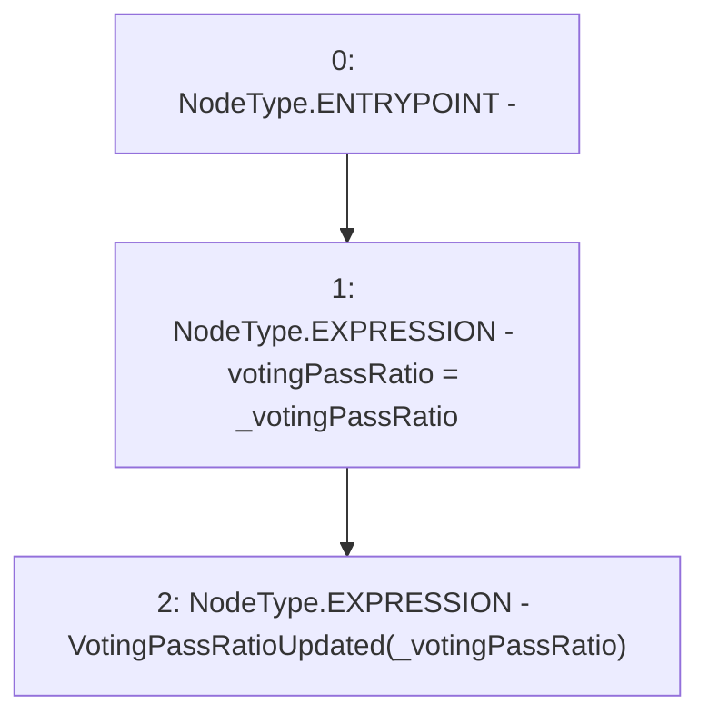

# Context: Extension._updateVotingPassRatio

**Contract:** `Extension` (Inherits: IExtension, Initializable)
**Signature:** `_updateVotingPassRatio(uint256)`
**Method Selector ID:** `Internal (No Method ID)`
**Visibility:** `internal`
**Environment-Free:** `Yes`
**Modifiers:** None

### State Variables Interaction
- **Reads:** None
- **Writes:** votingPassRatio

### Environment & Verification Flags
- **Uses Foundry Cheatcodes:** No
- **Has Echidna Properties:** No

### Internal Calls Tree
- None

### External Calls / Value Transfers
- None

### Control Flow Graph (CFG)


### Source Mapping
Declared in: `contracts/Pool/Extension.sol` on lines **186** to **189**

```solidity
    function _updateVotingPassRatio(uint256 _votingPassRatio) internal {
        votingPassRatio = _votingPassRatio;
        emit VotingPassRatioUpdated(_votingPassRatio);
    }

```
