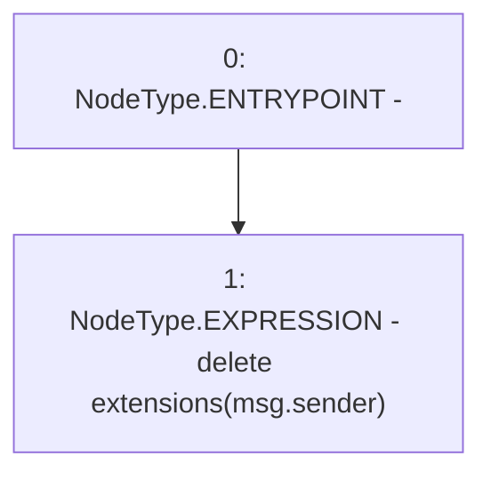

# Context: Extension.closePoolExtension

**Contract:** `Extension` (Inherits: IExtension, Initializable)
**Signature:** `closePoolExtension()`
**Method Selector ID:** `0x47cb7c6c`
**Visibility:** `external`
**Environment-Free:** `No (reads EVM state context)`
**Modifiers:** None

### State Variables Interaction
- **Reads:** extensions
- **Writes:** extensions

### Environment & Verification Flags
- **Uses Foundry Cheatcodes:** No
- **Has Echidna Properties:** No

### Internal Calls Tree
- None

### External Calls / Value Transfers
- None

### Control Flow Graph (CFG)


### Source Mapping
Declared in: `contracts/Pool/Extension.sol` on lines **174** to **176**

```solidity
    function closePoolExtension() external override {
        delete extensions[msg.sender];
    }

```
