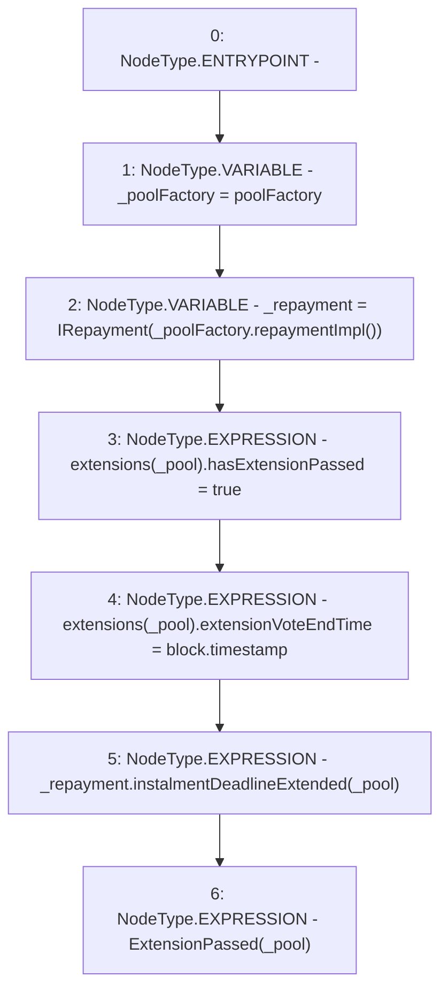

# Context: Extension.grantExtension

**Contract:** `Extension` (Inherits: IExtension, Initializable)
**Signature:** `grantExtension(address)`
**Method Selector ID:** `Internal (No Method ID)`
**Visibility:** `internal`
**Environment-Free:** `No (reads EVM state context)`
**Modifiers:** None

### State Variables Interaction
- **Reads:** extensions, poolFactory
- **Writes:** extensions

### Environment & Verification Flags
- **Uses Foundry Cheatcodes:** No
- **Has Echidna Properties:** No

### Internal Calls Tree
- None

### External Calls / Value Transfers
- `IRepayment.HIGH_LEVEL_CALL, dest:_repayment(IRepayment), function:instalmentDeadlineExtended, arguments:['_pool']  `
- `IPoolFactory.TMP_1393(address) = HIGH_LEVEL_CALL, dest:_poolFactory(IPoolFactory), function:repaymentImpl, arguments:[]  `

### Control Flow Graph (CFG)


### Source Mapping
Declared in: `contracts/Pool/Extension.sol` on lines **159** to **169**

```solidity
    function grantExtension(address _pool) internal {
        IPoolFactory _poolFactory = poolFactory;
        IRepayment _repayment = IRepayment(_poolFactory.repaymentImpl());

        extensions[_pool].hasExtensionPassed = true;
        extensions[_pool].extensionVoteEndTime = block.timestamp; // voting is over

        _repayment.instalmentDeadlineExtended(_pool);

        emit ExtensionPassed(_pool);
    }

```
