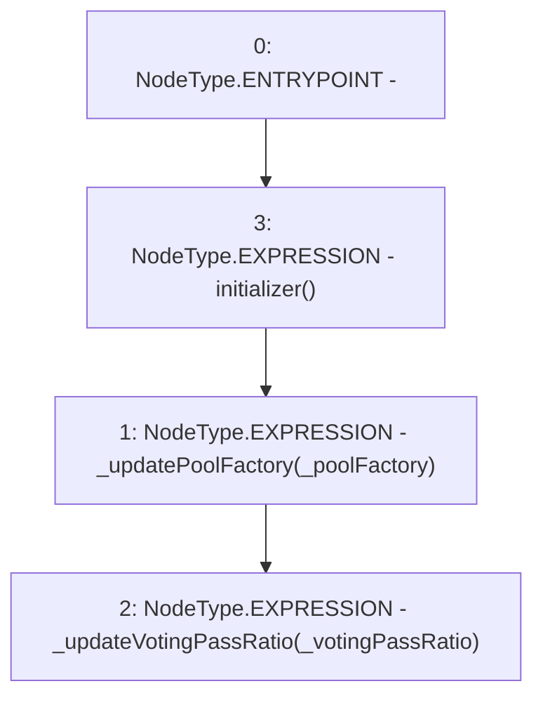

# Context: Extension.initialize

**Contract:** `Extension` (Inherits: IExtension, Initializable)
**Signature:** `initialize(address,uint256)`
**Method Selector ID:** `0xcd6dc687`
**Visibility:** `external`
**Environment-Free:** `Yes`
**Modifiers:**
- `initializer`
  ```solidity
  modifier initializer() {
          require(_initializing || _isConstructor() || !_initialized, "Initializable: contract is already initialized");
  
          bool isTopLevelCall = !_initializing;
          if (isTopLevelCall) {
              _initializing = true;
              _initialized = true;
          }
  
          _;
  
          if (isTopLevelCall) {
              _initializing = false;
          }
      }
  ```

### State Variables Interaction
- **Reads:** None
- **Writes:** None

### Environment & Verification Flags
- **Uses Foundry Cheatcodes:** No
- **Has Echidna Properties:** No

### Internal Calls Tree
- None

### External Calls / Value Transfers
- None

### Control Flow Graph (CFG)


### Source Mapping
Declared in: `contracts/Pool/Extension.sol` on lines **59** to **62**

```solidity
    function initialize(address _poolFactory, uint256 _votingPassRatio) external initializer {
        _updatePoolFactory(_poolFactory);
        _updateVotingPassRatio(_votingPassRatio);
    }

```
