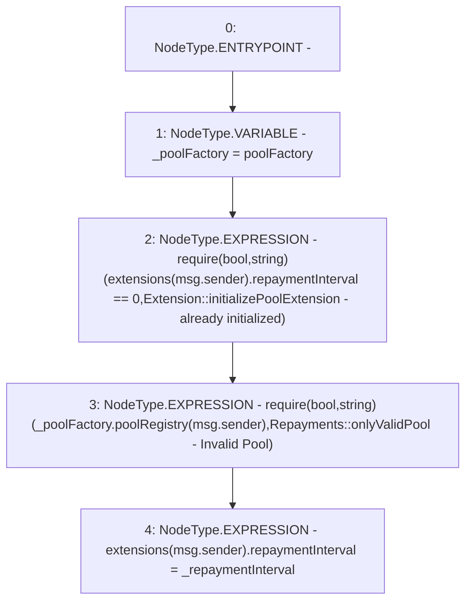

# Context: Extension.initializePoolExtension

**Contract:** `Extension` (Inherits: IExtension, Initializable)
**Signature:** `initializePoolExtension(uint256)`
**Method Selector ID:** `0xb5a70cea`
**Visibility:** `external`
**Environment-Free:** `No (reads EVM state context)`
**Modifiers:** None

### State Variables Interaction
- **Reads:** extensions, poolFactory
- **Writes:** extensions

### Assertion Checks & Business Requirements
- require/assert: `require(bool,string)(extensions[msg.sender].repaymentInterval == 0,Extension::initializePoolExtension - already initialized)`
- require/assert: `require(bool,string)(_poolFactory.poolRegistry(msg.sender),Repayments::onlyValidPool - Invalid Pool)`

### Environment & Verification Flags
- **Uses Foundry Cheatcodes:** No
- **Has Echidna Properties:** No

### Internal Calls Tree
- None

### External Calls / Value Transfers
- `IPoolFactory.TMP_1357(bool) = HIGH_LEVEL_CALL, dest:_poolFactory(IPoolFactory), function:poolRegistry, arguments:['msg.sender']  `

### Control Flow Graph (CFG)


### Source Mapping
Declared in: `contracts/Pool/Extension.sol` on lines **68** to **73**

```solidity
    function initializePoolExtension(uint256 _repaymentInterval) external override {
        IPoolFactory _poolFactory = poolFactory;
        require(extensions[msg.sender].repaymentInterval == 0, 'Extension::initializePoolExtension - already initialized');
        require(_poolFactory.poolRegistry(msg.sender), 'Repayments::onlyValidPool - Invalid Pool');
        extensions[msg.sender].repaymentInterval = _repaymentInterval;
    }

```
