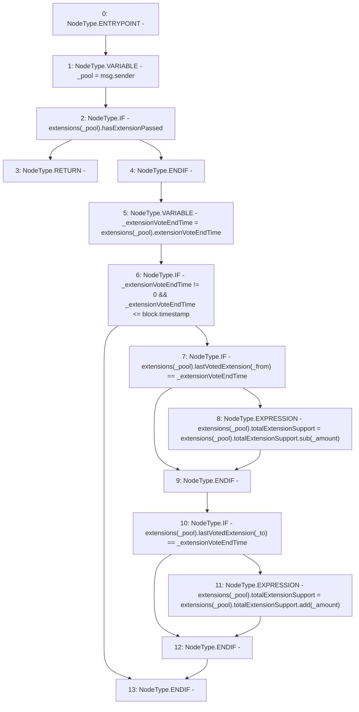

# Context: Extension.removeVotes

**Contract:** `Extension` (Inherits: IExtension, Initializable)
**Signature:** `removeVotes(address,address,uint256)`
**Method Selector ID:** `0x722eb6d1`
**Visibility:** `external`
**Environment-Free:** `No (reads EVM state context)`
**Modifiers:** None

### State Variables Interaction
- **Reads:** extensions
- **Writes:** extensions

### Environment & Verification Flags
- **Uses Foundry Cheatcodes:** No
- **Has Echidna Properties:** No

### Internal Calls Tree
- None

### External Calls / Value Transfers
- `SafeMath.TMP_1378(uint256) = LIBRARY_CALL, dest:SafeMath, function:SafeMath.add(uint256,uint256), arguments:['REF_510', '_amount'] `
- `SafeMath.TMP_1376(uint256) = LIBRARY_CALL, dest:SafeMath, function:SafeMath.sub(uint256,uint256), arguments:['REF_502', '_amount'] `

### Control Flow Graph (CFG)


### Source Mapping
Declared in: `contracts/Pool/Extension.sol` on lines **103** to **124**

```solidity
    function removeVotes(
        address _from,
        address _to,
        uint256 _amount
    ) external override {
        address _pool = msg.sender;
        if (extensions[_pool].hasExtensionPassed) {
            return;
        }

        uint256 _extensionVoteEndTime = extensions[_pool].extensionVoteEndTime;

        if (_extensionVoteEndTime != 0 && _extensionVoteEndTime <= block.timestamp) {
            if (extensions[_pool].lastVotedExtension[_from] == _extensionVoteEndTime) {
                extensions[_pool].totalExtensionSupport = extensions[_pool].totalExtensionSupport.sub(_amount);
            }

            if (extensions[_pool].lastVotedExtension[_to] == _extensionVoteEndTime) {
                extensions[_pool].totalExtensionSupport = extensions[_pool].totalExtensionSupport.add(_amount);
            }
        }
    }

```
