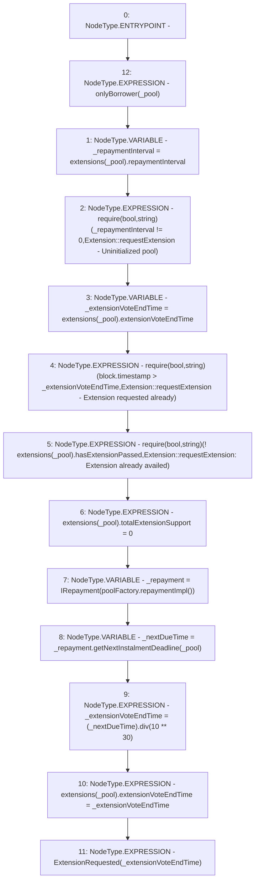

# Context: Extension.requestExtension

**Contract:** `Extension` (Inherits: IExtension, Initializable)
**Signature:** `requestExtension(address)`
**Method Selector ID:** `0x8afed92a`
**Visibility:** `external`
**Environment-Free:** `No (reads EVM state context)`
**Modifiers:**
- `onlyBorrower`
  ```solidity
  modifier onlyBorrower(address _pool) {
          require(IPool(_pool).borrower() == msg.sender, 'Not Borrower');
          _;
      }
  ```

### State Variables Interaction
- **Reads:** extensions, poolFactory
- **Writes:** extensions

### Assertion Checks & Business Requirements
- require/assert: `require(bool,string)(_repaymentInterval != 0,Extension::requestExtension - Uninitialized pool)`
- require/assert: `require(bool,string)(block.timestamp > _extensionVoteEndTime,Extension::requestExtension - Extension requested already)`
- require/assert: `require(bool,string)(! extensions[_pool].hasExtensionPassed,Extension::requestExtension: Extension already availed)`

### Environment & Verification Flags
- **Uses Foundry Cheatcodes:** No
- **Has Echidna Properties:** No

### Internal Calls Tree
- None

### External Calls / Value Transfers
- `IRepayment.TMP_1367(uint256) = HIGH_LEVEL_CALL, dest:_repayment(IRepayment), function:getNextInstalmentDeadline, arguments:['_pool']  `
- `SafeMath.TMP_1369(uint256) = LIBRARY_CALL, dest:SafeMath, function:SafeMath.div(uint256,uint256), arguments:['_nextDueTime', 'TMP_1368'] `
- `IPoolFactory.TMP_1365(address) = HIGH_LEVEL_CALL, dest:poolFactory(IPoolFactory), function:repaymentImpl, arguments:[]  `

### Control Flow Graph (CFG)


### Source Mapping
Declared in: `contracts/Pool/Extension.sol` on lines **79** to **94**

```solidity
    function requestExtension(address _pool) external onlyBorrower(_pool) {
        uint256 _repaymentInterval = extensions[_pool].repaymentInterval;
        require(_repaymentInterval != 0, 'Extension::requestExtension - Uninitialized pool');
        uint256 _extensionVoteEndTime = extensions[_pool].extensionVoteEndTime;
        require(block.timestamp > _extensionVoteEndTime, 'Extension::requestExtension - Extension requested already'); // _extensionVoteEndTime is 0 when no extension is active

        // This check is required so that borrower doesn't ask for more extension if previously an extension is already granted
        require(!extensions[_pool].hasExtensionPassed, 'Extension::requestExtension: Extension already availed');

        extensions[_pool].totalExtensionSupport = 0; // As we can multiple voting every time new voting start we have to make previous votes 0
        IRepayment _repayment = IRepayment(poolFactory.repaymentImpl());
        uint256 _nextDueTime = _repayment.getNextInstalmentDeadline(_pool);
        _extensionVoteEndTime = (_nextDueTime).div(10**30);
        extensions[_pool].extensionVoteEndTime = _extensionVoteEndTime; // this makes extension request single use
        emit ExtensionRequested(_extensionVoteEndTime);
    }

```
