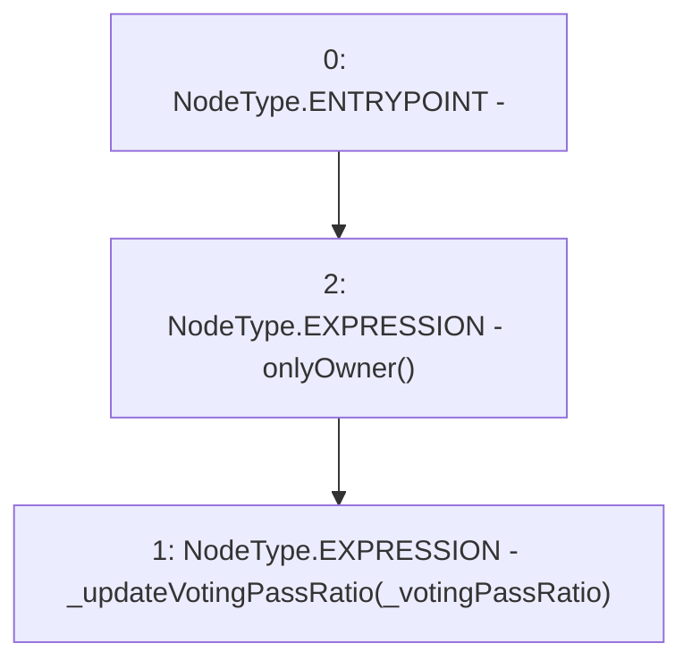

# Context: Extension.updateVotingPassRatio

**Contract:** `Extension` (Inherits: IExtension, Initializable)
**Signature:** `updateVotingPassRatio(uint256)`
**Method Selector ID:** `0x0347e804`
**Visibility:** `external`
**Environment-Free:** `No (reads EVM state context)`
**Modifiers:**
- `onlyOwner`
  ```solidity
  modifier onlyOwner() {
          require(msg.sender == poolFactory.owner(), 'Not owner');
          _;
      }
  ```

### State Variables Interaction
- **Reads:** None
- **Writes:** None

### Environment & Verification Flags
- **Uses Foundry Cheatcodes:** No
- **Has Echidna Properties:** No

### Internal Calls Tree
- None

### External Calls / Value Transfers
- None

### Control Flow Graph (CFG)


### Source Mapping
Declared in: `contracts/Pool/Extension.sol` on lines **182** to **184**

```solidity
    function updateVotingPassRatio(uint256 _votingPassRatio) external onlyOwner {
        _updateVotingPassRatio(_votingPassRatio);
    }

```
