# Context: Extension.voteOnExtension

**Contract:** `Extension` (Inherits: IExtension, Initializable)
**Signature:** `voteOnExtension(address)`
**Method Selector ID:** `0x80d59c85`
**Visibility:** `external`
**Environment-Free:** `No (reads EVM state context)`
**Modifiers:** None

### State Variables Interaction
- **Reads:** extensions, votingPassRatio
- **Writes:** extensions

### Assertion Checks & Business Requirements
- require/assert: `require(bool,string)(block.timestamp < _extensionVoteEndTime,Pool::voteOnExtension - Voting is over)`
- require/assert: `require(bool,string)(_balance != 0,Pool::voteOnExtension - Not a valid lender for pool)`
- require/assert: `require(bool,string)(_lastVotedExtension != _extensionVoteEndTime,Pool::voteOnExtension - you have already voted)`

### Environment & Verification Flags
- **Uses Foundry Cheatcodes:** No
- **Has Echidna Properties:** No

### Internal Calls Tree
- None

### External Calls / Value Transfers
- `SafeMath.TMP_1386(uint256) = LIBRARY_CALL, dest:SafeMath, function:SafeMath.add(uint256,uint256), arguments:['_extensionSupport', '_balance'] `
- `SafeMath.TMP_1390(uint256) = LIBRARY_CALL, dest:SafeMath, function:SafeMath.div(uint256,uint256), arguments:['TMP_1388', 'TMP_1389'] `
- `SafeMath.TMP_1388(uint256) = LIBRARY_CALL, dest:SafeMath, function:SafeMath.mul(uint256,uint256), arguments:['_totalSupply', '_votingPassRatio'] `
- `IPool.TUPLE_15(uint256,uint256) = HIGH_LEVEL_CALL, dest:TMP_1381(IPool), function:getBalanceDetails, arguments:['msg.sender']  `

### Control Flow Graph (CFG)

```mermaid
flowchart TD
    Node_0["0: NodeType.ENTRYPOINT - "]
    Node_0 --> Node_1
    Node_1["1: NodeType.VARIABLE - _extensionVoteEndTime = extensions(_pool).extensionVoteEndTime"]
    Node_1 --> Node_2
    Node_2["2: NodeType.EXPRESSION - require(bool,string)(block.timestamp < _extensionVoteEndTime,Pool::voteOnExtension - Voting is over)"]
    Node_2 --> Node_3
    Node_3["3: NodeType.VARIABLE - "]
    Node_3 --> Node_4
    Node_4["4: NodeType.VARIABLE - "]
    Node_4 --> Node_5
    Node_5["5: NodeType.EXPRESSION - (_balance,_totalSupply) = IPool(_pool).getBalanceDetails(msg.sender)"]
    Node_5 --> Node_6
    Node_6["6: NodeType.EXPRESSION - require(bool,string)(_balance != 0,Pool::voteOnExtension - Not a valid lender for pool)"]
    Node_6 --> Node_7
    Node_7["7: NodeType.VARIABLE - _votingPassRatio = votingPassRatio"]
    Node_7 --> Node_8
    Node_8["8: NodeType.VARIABLE - _lastVotedExtension = extensions(_pool).lastVotedExtension(msg.sender)"]
    Node_8 --> Node_9
    Node_9["9: NodeType.EXPRESSION - require(bool,string)(_lastVotedExtension != _extensionVoteEndTime,Pool::voteOnExtension - you have already voted)"]
    Node_9 --> Node_10
    Node_10["10: NodeType.VARIABLE - _extensionSupport = extensions(_pool).totalExtensionSupport"]
    Node_10 --> Node_11
    Node_11["11: NodeType.EXPRESSION - _lastVotedExtension = _extensionVoteEndTime"]
    Node_11 --> Node_12
    Node_12["12: NodeType.EXPRESSION - _extensionSupport = _extensionSupport.add(_balance)"]
    Node_12 --> Node_13
    Node_13["13: NodeType.EXPRESSION - extensions(_pool).lastVotedExtension(msg.sender) = _lastVotedExtension"]
    Node_13 --> Node_14
    Node_14["14: NodeType.EXPRESSION - LenderVoted(msg.sender,_extensionSupport,_lastVotedExtension)"]
    Node_14 --> Node_15
    Node_15["15: NodeType.EXPRESSION - extensions(_pool).totalExtensionSupport = _extensionSupport"]
    Node_15 --> Node_16
    Node_16["16: NodeType.IF - ((_extensionSupport)) >= (_totalSupply.mul(_votingPassRatio)).div(10 ** 30)"]
    Node_16 --> Node_17
    Node_16 --> Node_18
    Node_17["17: NodeType.EXPRESSION - grantExtension(_pool)"]
    Node_17 --> Node_18
    Node_18["18: NodeType.ENDIF - "]
```


### Source Mapping
Declared in: `contracts/Pool/Extension.sol` on lines **130** to **153**

```solidity
    function voteOnExtension(address _pool) external {
        uint256 _extensionVoteEndTime = extensions[_pool].extensionVoteEndTime;
        require(block.timestamp < _extensionVoteEndTime, 'Pool::voteOnExtension - Voting is over');

        (uint256 _balance, uint256 _totalSupply) = IPool(_pool).getBalanceDetails(msg.sender);
        require(_balance != 0, 'Pool::voteOnExtension - Not a valid lender for pool');

        uint256 _votingPassRatio = votingPassRatio;

        uint256 _lastVotedExtension = extensions[_pool].lastVotedExtension[msg.sender]; //Lender last vote time need to store it as it checks that a lender only votes once
        require(_lastVotedExtension != _extensionVoteEndTime, 'Pool::voteOnExtension - you have already voted');

        uint256 _extensionSupport = extensions[_pool].totalExtensionSupport;
        _lastVotedExtension = _extensionVoteEndTime;
        _extensionSupport = _extensionSupport.add(_balance);

        extensions[_pool].lastVotedExtension[msg.sender] = _lastVotedExtension;
        emit LenderVoted(msg.sender, _extensionSupport, _lastVotedExtension);
        extensions[_pool].totalExtensionSupport = _extensionSupport;

        if (((_extensionSupport)) >= (_totalSupply.mul(_votingPassRatio)).div(10**30)) {
            grantExtension(_pool);
        }
    }

```
