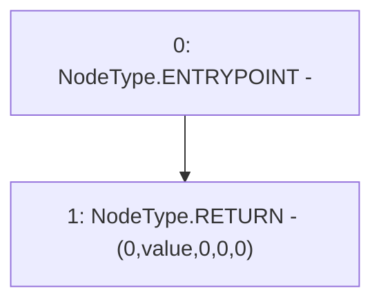

# Context: FluxAggregator.getRoundData

**Contract:** `FluxAggregator` (Inherits: None)
**Signature:** `getRoundData(uint80) returns (uint80, int256, uint256, uint256, uint80)`
**Method Selector ID:** `0x9a6fc8f5`
**Visibility:** `external`
**Environment-Free:** `Yes`
**Modifiers:** None

### State Variables Interaction
- **Reads:** value
- **Writes:** None

### Environment & Verification Flags
- **Uses Foundry Cheatcodes:** No
- **Has Echidna Properties:** No

### Internal Calls Tree
- None

### External Calls / Value Transfers
- None

### Control Flow Graph (CFG)


### Source Mapping
Declared in: `contracts/mocks/FluxAggregator.sol` on lines **16** to **28**

```solidity
    function getRoundData(uint80 _roundId)
        external
        view
        returns (
            uint80,
            int256,
            uint256,
            uint256,
            uint80
        )
    {
        return (0, value, 0, 0, 0);
    }

```
