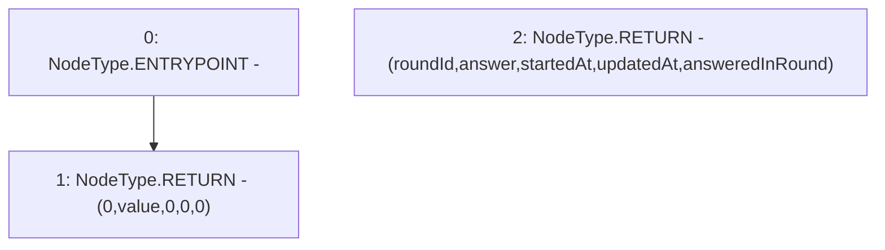

# Context: FluxAggregator.latestRoundData

**Contract:** `FluxAggregator` (Inherits: None)
**Signature:** `latestRoundData() returns (uint80, int256, uint256, uint256, uint80)`
**Method Selector ID:** `0xfeaf968c`
**Visibility:** `external`
**Environment-Free:** `Yes`
**Modifiers:** None

### State Variables Interaction
- **Reads:** value
- **Writes:** None

### Environment & Verification Flags
- **Uses Foundry Cheatcodes:** No
- **Has Echidna Properties:** No

### Internal Calls Tree
- None

### External Calls / Value Transfers
- None

### Control Flow Graph (CFG)


### Source Mapping
Declared in: `contracts/mocks/FluxAggregator.sol` on lines **30** to **42**

```solidity
    function latestRoundData()
        external
        view
        returns (
            uint80 roundId,
            int256 answer,
            uint256 startedAt,
            uint256 updatedAt,
            uint80 answeredInRound
        )
    {
        return (0, value, 0, 0, 0);
    }

```
