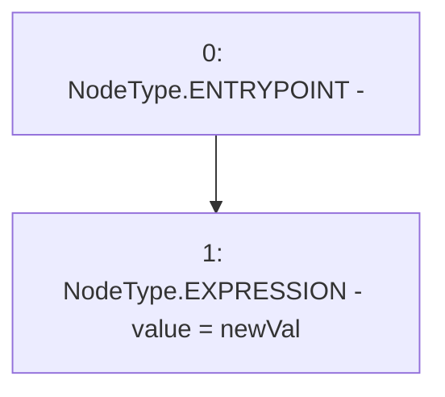

# Context: FluxAggregator.setValue

**Contract:** `FluxAggregator` (Inherits: None)
**Signature:** `setValue(int256)`
**Method Selector ID:** `0x5093dc7d`
**Visibility:** `public`
**Environment-Free:** `Yes`
**Modifiers:** None

### State Variables Interaction
- **Reads:** None
- **Writes:** value

### Environment & Verification Flags
- **Uses Foundry Cheatcodes:** No
- **Has Echidna Properties:** No

### Internal Calls Tree
- None

### External Calls / Value Transfers
- None

### Control Flow Graph (CFG)


### Source Mapping
Declared in: `contracts/mocks/FluxAggregator.sol` on lines **12** to **14**

```solidity
    function setValue(int256 newVal) public {
        value = newVal;
    }

```
