# Context: FullMath.mulDiv

**Contract:** `FullMath` (Inherits: None)
**Signature:** `mulDiv(uint256,uint256,uint256) returns (uint256)`
**Method Selector ID:** `Internal (No Method ID)`
**Visibility:** `internal`
**Environment-Free:** `Yes`
**Modifiers:** None

### State Variables Interaction
- **Reads:** None
- **Writes:** None

### Assertion Checks & Business Requirements
- require/assert: `require(bool)(denominator > 0)`
- require/assert: `require(bool)(denominator > prod1)`

### Environment & Verification Flags
- **Uses Foundry Cheatcodes:** No
- **Has Echidna Properties:** No

### Internal Calls Tree
- None

### External Calls / Value Transfers
- None

### Control Flow Graph (CFG)

```mermaid
flowchart TD
    Node_0["0: NodeType.ENTRYPOINT - "]
    Node_0 --> Node_1
    Node_1["1: NodeType.VARIABLE - "]
    Node_1 --> Node_2
    Node_2["2: NodeType.VARIABLE - "]
    Node_2 --> Node_3
    Node_3["3: NodeType.ASSEMBLY - "]
    Node_3 --> Node_4
    Node_4["4: NodeType.VARIABLE - "]
    Node_4 --> Node_5
    Node_5["5: NodeType.EXPRESSION - mm_mulDiv_asm_0 = mulmod(uint256,uint256,uint256)(a,b,~ 0)"]
    Node_5 --> Node_6
    Node_6["6: NodeType.EXPRESSION - prod0 = a * b"]
    Node_6 --> Node_7
    Node_7["7: NodeType.EXPRESSION - prod1 = mm_mulDiv_asm_0 - prod0 - mm_mulDiv_asm_0 < prod0"]
    Node_7 --> Node_8
    Node_8["8: NodeType.ENDASSEMBLY - "]
    Node_8 --> Node_9
    Node_9["9: NodeType.IF - prod1 == 0"]
    Node_9 --> Node_10
    Node_9 --> Node_15
    Node_10["10: NodeType.EXPRESSION - require(bool)(denominator > 0)"]
    Node_10 --> Node_11
    Node_11["11: NodeType.ASSEMBLY - "]
    Node_11 --> Node_12
    Node_12["12: NodeType.EXPRESSION - result = prod0 / denominator"]
    Node_12 --> Node_13
    Node_13["13: NodeType.ENDASSEMBLY - "]
    Node_13 --> Node_14
    Node_14["14: NodeType.RETURN - result"]
    Node_15["15: NodeType.ENDIF - "]
    Node_15 --> Node_16
    Node_16["16: NodeType.EXPRESSION - require(bool)(denominator > prod1)"]
    Node_16 --> Node_17
    Node_17["17: NodeType.VARIABLE - "]
    Node_17 --> Node_18
    Node_18["18: NodeType.ASSEMBLY - "]
    Node_18 --> Node_19
    Node_19["19: NodeType.EXPRESSION - remainder = mulmod(uint256,uint256,uint256)(a,b,denominator)"]
    Node_19 --> Node_20
    Node_20["20: NodeType.ENDASSEMBLY - "]
    Node_20 --> Node_21
    Node_21["21: NodeType.ASSEMBLY - "]
    Node_21 --> Node_22
    Node_22["22: NodeType.EXPRESSION - prod1 = prod1 - remainder > prod0"]
    Node_22 --> Node_23
    Node_23["23: NodeType.EXPRESSION - prod0 = prod0 - remainder"]
    Node_23 --> Node_24
    Node_24["24: NodeType.ENDASSEMBLY - "]
    Node_24 --> Node_25
    Node_25["25: NodeType.VARIABLE - twos = - denominator & denominator"]
    Node_25 --> Node_26
    Node_26["26: NodeType.ASSEMBLY - "]
    Node_26 --> Node_27
    Node_27["27: NodeType.EXPRESSION - denominator = denominator / twos"]
    Node_27 --> Node_28
    Node_28["28: NodeType.ENDASSEMBLY - "]
    Node_28 --> Node_29
    Node_29["29: NodeType.ASSEMBLY - "]
    Node_29 --> Node_30
    Node_30["30: NodeType.EXPRESSION - prod0 = prod0 / twos"]
    Node_30 --> Node_31
    Node_31["31: NodeType.ENDASSEMBLY - "]
    Node_31 --> Node_32
    Node_32["32: NodeType.ASSEMBLY - "]
    Node_32 --> Node_33
    Node_33["33: NodeType.EXPRESSION - twos = 0 - twos / twos + 1"]
    Node_33 --> Node_34
    Node_34["34: NodeType.ENDASSEMBLY - "]
    Node_34 --> Node_35
    Node_35["35: NodeType.EXPRESSION - prod0 |= prod1 * twos"]
    Node_35 --> Node_36
    Node_36["36: NodeType.VARIABLE - inv = (3 * denominator) ^ 2"]
    Node_36 --> Node_37
    Node_37["37: NodeType.EXPRESSION - inv *= 2 - denominator * inv"]
    Node_37 --> Node_38
    Node_38["38: NodeType.EXPRESSION - inv *= 2 - denominator * inv"]
    Node_38 --> Node_39
    Node_39["39: NodeType.EXPRESSION - inv *= 2 - denominator * inv"]
    Node_39 --> Node_40
    Node_40["40: NodeType.EXPRESSION - inv *= 2 - denominator * inv"]
    Node_40 --> Node_41
    Node_41["41: NodeType.EXPRESSION - inv *= 2 - denominator * inv"]
    Node_41 --> Node_42
    Node_42["42: NodeType.EXPRESSION - inv *= 2 - denominator * inv"]
    Node_42 --> Node_43
    Node_43["43: NodeType.EXPRESSION - result = prod0 * inv"]
    Node_43 --> Node_44
    Node_44["44: NodeType.RETURN - result"]
    Node_45["45: NodeType.RETURN - result"]
```


### Source Mapping
Declared in: `node_modules/@uniswap/v3-core/contracts/libraries/FullMath.sol` on lines **14** to **106**

```solidity
    function mulDiv(
        uint256 a,
        uint256 b,
        uint256 denominator
    ) internal pure returns (uint256 result) {
        // 512-bit multiply [prod1 prod0] = a * b
        // Compute the product mod 2**256 and mod 2**256 - 1
        // then use the Chinese Remainder Theorem to reconstruct
        // the 512 bit result. The result is stored in two 256
        // variables such that product = prod1 * 2**256 + prod0
        uint256 prod0; // Least significant 256 bits of the product
        uint256 prod1; // Most significant 256 bits of the product
        assembly {
            let mm := mulmod(a, b, not(0))
            prod0 := mul(a, b)
            prod1 := sub(sub(mm, prod0), lt(mm, prod0))
        }

        // Handle non-overflow cases, 256 by 256 division
        if (prod1 == 0) {
            require(denominator > 0);
            assembly {
                result := div(prod0, denominator)
            }
            return result;
        }

        // Make sure the result is less than 2**256.
        // Also prevents denominator == 0
        require(denominator > prod1);

        ///////////////////////////////////////////////
        // 512 by 256 division.
        ///////////////////////////////////////////////

        // Make division exact by subtracting the remainder from [prod1 prod0]
        // Compute remainder using mulmod
        uint256 remainder;
        assembly {
            remainder := mulmod(a, b, denominator)
        }
        // Subtract 256 bit number from 512 bit number
        assembly {
            prod1 := sub(prod1, gt(remainder, prod0))
            prod0 := sub(prod0, remainder)
        }

        // Factor powers of two out of denominator
        // Compute largest power of two divisor of denominator.
        // Always >= 1.
        uint256 twos = -denominator & denominator;
        // Divide denominator by power of two
        assembly {
            denominator := div(denominator, twos)
        }

        // Divide [prod1 prod0] by the factors of two
        assembly {
            prod0 := div(prod0, twos)
        }
        // Shift in bits from prod1 into prod0. For this we need
        // to flip `twos` such that it is 2**256 / twos.
        // If twos is zero, then it becomes one
        assembly {
            twos := add(div(sub(0, twos), twos), 1)
        }
        prod0 |= prod1 * twos;

        // Invert denominator mod 2**256
        // Now that denominator is an odd number, it has an inverse
        // modulo 2**256 such that denominator * inv = 1 mod 2**256.
        // Compute the inverse by starting with a seed that is correct
        // correct for four bits. That is, denominator * inv = 1 mod 2**4
        uint256 inv = (3 * denominator) ^ 2;
        // Now use Newton-Raphson iteration to improve the precision.
        // Thanks to Hensel's lifting lemma, this also works in modular
        // arithmetic, doubling the correct bits in each step.
        inv *= 2 - denominator * inv; // inverse mod 2**8
        inv *= 2 - denominator * inv; // inverse mod 2**16
        inv *= 2 - denominator * inv; // inverse mod 2**32
        inv *= 2 - denominator * inv; // inverse mod 2**64
        inv *= 2 - denominator * inv; // inverse mod 2**128
        inv *= 2 - denominator * inv; // inverse mod 2**256

        // Because the division is now exact we can divide by multiplying
        // with the modular inverse of denominator. This will give us the
        // correct result modulo 2**256. Since the precoditions guarantee
        // that the outcome is less than 2**256, this is the final result.
        // We don't need to compute the high bits of the result and prod1
        // is no longer required.
        result = prod0 * inv;
        return result;
    }

```
