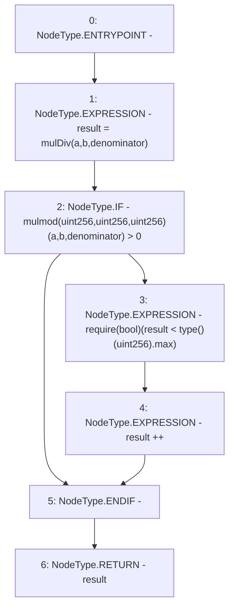

# Context: FullMath.mulDivRoundingUp

**Contract:** `FullMath` (Inherits: None)
**Signature:** `mulDivRoundingUp(uint256,uint256,uint256) returns (uint256)`
**Method Selector ID:** `Internal (No Method ID)`
**Visibility:** `internal`
**Environment-Free:** `Yes`
**Modifiers:** None

### State Variables Interaction
- **Reads:** None
- **Writes:** None

### Assertion Checks & Business Requirements
- require/assert: `require(bool)(result < type()(uint256).max)`

### Environment & Verification Flags
- **Uses Foundry Cheatcodes:** No
- **Has Echidna Properties:** No

### Internal Calls Tree
- None

### External Calls / Value Transfers
- None

### Control Flow Graph (CFG)


### Source Mapping
Declared in: `node_modules/@uniswap/v3-core/contracts/libraries/FullMath.sol` on lines **113** to **123**

```solidity
    function mulDivRoundingUp(
        uint256 a,
        uint256 b,
        uint256 denominator
    ) internal pure returns (uint256 result) {
        result = mulDiv(a, b, denominator);
        if (mulmod(a, b, denominator) > 0) {
            require(result < type(uint256).max);
            result++;
        }
    }

```
