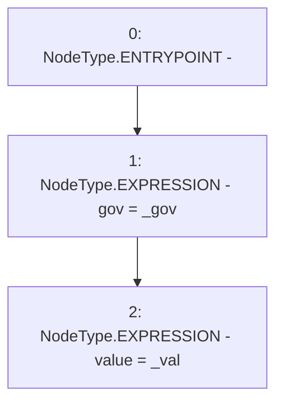

# Context: GovernanceTester.constructor

**Contract:** `GovernanceTester` (Inherits: None)
**Signature:** `constructor(address,uint256)`
**Method Selector ID:** `0x2a8c7b93`
**Visibility:** `public`
**Environment-Free:** `Yes`
**Modifiers:** None

### State Variables Interaction
- **Reads:** None
- **Writes:** gov, value

### Environment & Verification Flags
- **Uses Foundry Cheatcodes:** No
- **Has Echidna Properties:** No

### Internal Calls Tree
- None

### External Calls / Value Transfers
- None

### Control Flow Graph (CFG)


### Source Mapping
Declared in: `contracts/mocks/GovernanceTester.sol` on lines **15** to **18**

```solidity
    constructor(address _gov, uint256 _val) {
        gov = _gov;
        value = _val;
    }

```
