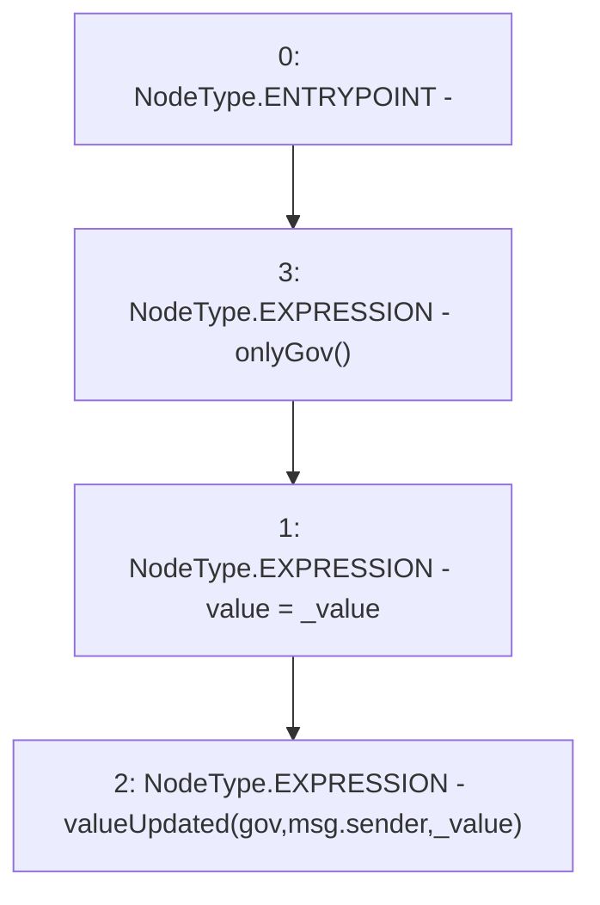

# Context: GovernanceTester.update

**Contract:** `GovernanceTester` (Inherits: None)
**Signature:** `update(uint256)`
**Method Selector ID:** `0x82ab890a`
**Visibility:** `public`
**Environment-Free:** `No (reads EVM state context)`
**Modifiers:**
- `onlyGov`
  ```solidity
  modifier onlyGov() {
          require(msg.sender == gov, 'Only Governance should be able to hit');
          _;
      }
  ```

### State Variables Interaction
- **Reads:** gov
- **Writes:** value

### Environment & Verification Flags
- **Uses Foundry Cheatcodes:** No
- **Has Echidna Properties:** No

### Internal Calls Tree
- None

### External Calls / Value Transfers
- None

### Control Flow Graph (CFG)


### Source Mapping
Declared in: `contracts/mocks/GovernanceTester.sol` on lines **20** to **23**

```solidity
    function update(uint256 _value) public onlyGov {
        value = _value;
        emit valueUpdated(gov, msg.sender, _value);
    }

```
