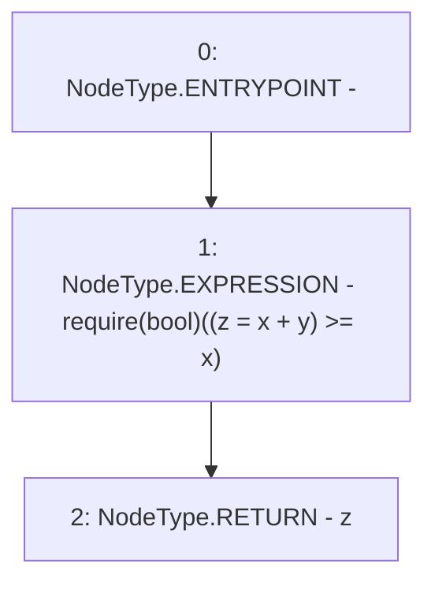

# Context: LowGasSafeMath.add

**Contract:** `LowGasSafeMath` (Inherits: None)
**Signature:** `add(uint256,uint256) returns (uint256)`
**Method Selector ID:** `Internal (No Method ID)`
**Visibility:** `internal`
**Environment-Free:** `Yes`
**Modifiers:** None

### State Variables Interaction
- **Reads:** None
- **Writes:** None

### Assertion Checks & Business Requirements
- require/assert: `require(bool)((z = x + y) >= x)`

### Environment & Verification Flags
- **Uses Foundry Cheatcodes:** No
- **Has Echidna Properties:** No

### Internal Calls Tree
- None

### External Calls / Value Transfers
- None

### Control Flow Graph (CFG)


### Source Mapping
Declared in: `node_modules/@uniswap/v3-core/contracts/libraries/LowGasSafeMath.sol` on lines **11** to **13**

```solidity
    function add(uint256 x, uint256 y) internal pure returns (uint256 z) {
        require((z = x + y) >= x);
    }

```
