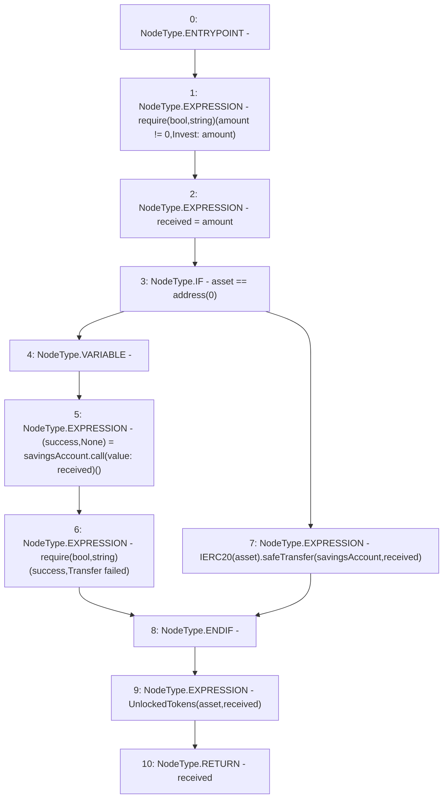

# Context: NoYield._unlockTokens

**Contract:** `NoYield` (Inherits: ReentrancyGuard, OwnableUpgradeable, ContextUpgradeable, Initializable, IYield)
**Signature:** `_unlockTokens(address,uint256) returns (uint256)`
**Method Selector ID:** `Internal (No Method ID)`
**Visibility:** `internal`
**Environment-Free:** `Yes`
**Modifiers:** None

### State Variables Interaction
- **Reads:** savingsAccount
- **Writes:** None

### Assertion Checks & Business Requirements
- require/assert: `require(bool,string)(amount != 0,Invest: amount)`
- require/assert: `require(bool,string)(success,Transfer failed)`

### Environment & Verification Flags
- **Uses Foundry Cheatcodes:** No
- **Has Echidna Properties:** No

### Internal Calls Tree
- None

### External Calls / Value Transfers
- `SafeERC20.LIBRARY_CALL, dest:SafeERC20, function:SafeERC20.safeTransfer(IERC20,address,uint256), arguments:['TMP_3824', 'savingsAccount', 'received'] `
- `low-level-call`

### Control Flow Graph (CFG)


### Source Mapping
Declared in: `contracts/yield/NoYield.sol` on lines **134** to **144**

```solidity
    function _unlockTokens(address asset, uint256 amount) internal returns (uint256 received) {
        require(amount != 0, 'Invest: amount');
        received = amount;
        if (asset == address(0)) {
            (bool success, ) = savingsAccount.call{value: received}('');
            require(success, 'Transfer failed');
        } else {
            IERC20(asset).safeTransfer(savingsAccount, received);
        }
        emit UnlockedTokens(asset, received);
    }

```
